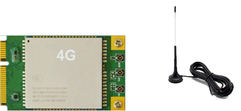

Hardware
========

1 Introduction
-------------

1.1 Summary
^^^^^^^^^^^^

The EM3566 is a single-board computer powered by a Rockchip RK3566 processor featuring four
ARM Cortex-A55 CPU cores and Mali-G52-2EE graphics and designed for AIoT applications such
as AI robot, smart POS machine, face recognition terminal, and business display integrated
equipment.

1.2 RK3566 Specifications
^^^^^^^^^^^^^^^^^^^^^^^^^^

.. csv-table:: 
 :header: "Item", "Specifications"
 :widths: 15, 30

 "SoC", "RockChip RK3566"
 "CPU", "Quad-core 64-bit Cortex-A55, 22nm lithography process, frequency up to 1.8GHz"
 "GPU", "ARM G52 2EE. Supports OpenGL ES 1.1/2.0/3.2. OpenCL 2.0. Vulkan 1.1. Embedded high-performance 2D acceleration hardware"
 "NPU", "0.8Tops"

1.3 EM3566 Features
^^^^^^^^^^^^^^^^^^^^^^

.. figure:: ./image/EM3566-Interfaces.jpg
   :align: center
   :alt: EM3566_interface
   :width: 400px
   
.. list-table:: 
    :widths: 15 30
    :header-rows: 1

    * - Item
      - Description
    * - CPU
      - RockChip RK3566 quad-core Cortex-A55 @ up to 1.8GHz
    * - Memory
      - 2GB, 4GB, or 8GB LPDDR4 RAM
        32Bit, supports all-data-link ECC
    * - Storage
      - 8GB / 32GB / 64GB / 128GB eMMC. 
        M.2 PCIe 2.0 socket NVMe SSD (Expand with 2242 NVMe SSD).
        MicroSD card slot (Expand with TF card). 
        SATA3.0 (can switch between SATA and USB 3.0.
    * - Power Supply
      - 12V/3A DC input jack
    * - USB
      - 1x USB OTG 2.0
        4x USB Host 2.0 (USB-AF or 4-pin connector).
        1x USB 3.0.
    * - Connectivity
      - Gigabit Ethernet RJ45 ports via Realtek RTL8211F-CG controller. 2.4G WiFi(802.11b/g/n) with Bluetooth 4.0. mPCIe socket with Nano SIM card port to support 4G&GPS module.
    * - Serial
      - 1x Serial port for debug, 3-pin connector. 2x UART, 4-pin connectors. 1x RS485, 2-pin header or 3-pin connector.
    * - Video
      - HDMI 2.0, 4Kp60. MIPI DSI/LVDS, 1080p60. eDP 1.3, 2560x1600 @60Hz. MEMS_Module for Video output.
    * - Audio
      - 3.5mm audio I/O jack. ES8388 audio codec. 8-channel audio via HDMI.
    * - Camera(optional)
      - 2x Cameras via MIPI CSI (24pin FPC connector)
    * - Keys & Switch
      - 1x Recover Key. 1x Switch for switch between SATA and USB 3.0
    * - Other features
      - Other features	RTC with battery connector; IR receiver; GPIO; ADC
    * - Dimension
      - 135mm x 95mm

1.4 Block Diagram
^^^^^^^^^^^^^^^^^^^^^^
.. figure:: ./image/EM3566_SBC_Block_diagram.gif
   :align: center
   :alt: EM3566_SBC_Block_diagram
   :width: 400px

1.5 CPU module Introduction
^^^^^^^^^^^^^^^^^^^^^^^^^^^^

The CPU module CM3566 features 2GB LPDDR4 RAM and 8GB eMMC Flash. 

**CM3566 specification** 

- Pin number – 186 pins, 0.9mm pitch
- Dimension – 40mm x 47mm
- Layer – 8 Layers, complying with EMS/EMI:
- Power supply – DC 3.3V 
- Application – smart Device, advertising devices, TV box, POS systems, vehicle control terminals, AI robot, business display integrated equipment, etc.

.. figure:: ./image/CM3566_PCB_Dimension.png
   :align: center
   :alt: CM3566_PCB_Dimension
   :width: 350px
   
**Pin Definition**

+---+-----------------+--------------------+---------------+---------+
|Pin|Signal           |Description or funct|GPIO serial    |IO Voltag|
|   |                 |ions                |               |e        |
+===+=================+====================+===============+=========+
| 1 | VCC3V3_SYS      | 3.3V Main Power    |               | 3.3V    |
|   |                 | input              |               |         |
+---+-----------------+--------------------+---------------+---------+
| 2 | VCC3V3_SYS      | 3.3V Main Power    |               | 3.3V    |
|   |                 | input              |               |         |
+---+-----------------+--------------------+---------------+---------+
| 3 | VCC3V3_SYS      | 3.3V Main Power    |               | 3.3V    |
|   |                 | input              |               |         |
+---+-----------------+--------------------+---------------+---------+
| 4 | VCC_RTC         | RTC button Cell    |               | 3.      |
|   |                 | Power input        |               | 0V-1.8V |
+---+-----------------+--------------------+---------------+---------+
| 5 | PMIC_32KOUT     | RTC                |               | 3.3V    |
|   |                 | clock(32.768khz)   |               |         |
|   |                 | output             |               |         |
+---+-----------------+--------------------+---------------+---------+
| 6 | GND             | Ground             |               | 0V      |
+---+-----------------+--------------------+---------------+---------+
| 7 | HDMITX_CEC_M0   |                    | GPIO4_D1_u    | 3.3V    |
+---+-----------------+--------------------+---------------+---------+
| 8 | HDMITX_SDA      | Pull up 2.2K       | GPIO4_D0_u    | 3.3V    |
|   |                 | inside             |               |         |
+---+-----------------+--------------------+---------------+---------+
| 9 | HDMITX_SCL      | Pull up 2.2K       | GPIO4_C7_u    | 3.3V    |
|   |                 | inside             |               |         |
+---+-----------------+--------------------+---------------+---------+
| 1 | GND             | Ground             |               | 0V      |
| 0 |                 |                    |               |         |
+---+-----------------+--------------------+---------------+---------+
| 1 | GMA             | RGMII reference    | GPIO3_C0_d    | 3.3V    |
| 1 | C1_MCLKINOUT_M0 | clock              |               |         |
|   |                 | input(125Mhz)      |               |         |
+---+-----------------+--------------------+---------------+---------+
| 1 | GND             | Ground             |               | 0V      |
| 2 |                 |                    |               |         |
+---+-----------------+--------------------+---------------+---------+
| 1 | GMAC1_TXD0_M0   |                    | GPIO3_B5_d    | 3.3V    |
| 3 |                 |                    |               |         |
+---+-----------------+--------------------+---------------+---------+
| 1 | GMAC1_TXD1_M0   |                    | GPIO3_B6_d    | 3.3V    |
| 4 |                 |                    |               |         |
+---+-----------------+--------------------+---------------+---------+
| 1 | GMAC1_TXEN_M0   |                    | GPIO3_B7_d    | 3.3V    |
| 5 |                 |                    |               |         |
+---+-----------------+--------------------+---------------+---------+
| 1 | GM              |                    | GPIO3_B3_d    | 3.3V    |
| 6 | AC1_RXDV_CRS_M0 |                    |               |         |
+---+-----------------+--------------------+---------------+---------+
| 1 | GMAC1_RXD1_M0   |                    | GPIO3_B2_d    | 3.3V    |
| 7 |                 |                    |               |         |
+---+-----------------+--------------------+---------------+---------+
| 1 | GMAC1_RXD0_M0   |                    | GPIO3_B1_d    | 3.3V    |
| 8 |                 |                    |               |         |
+---+-----------------+--------------------+---------------+---------+
| 1 | GMAC1_RXD3_M0   |                    | GPIO3_A5_d    | 3.3V    |
| 9 |                 |                    |               |         |
+---+-----------------+--------------------+---------------+---------+
| 2 | GMAC1_RXD2_M0   |                    | GPIO3_A4_d    | 3.3V    |
| 0 |                 |                    |               |         |
+---+-----------------+--------------------+---------------+---------+
| 2 | GMAC1_RXCLK_M0  |                    | GPIO3_A7_d    | 3.3V    |
| 1 |                 |                    |               |         |
+---+-----------------+--------------------+---------------+---------+
| 2 | GMAC1_TXD2_M0   |                    | GPIO3_A2_d    | 3.3V    |
| 2 |                 |                    |               |         |
+---+-----------------+--------------------+---------------+---------+
| 2 | GMAC1_TXD3_M0   |                    | GPIO3_A3_d    | 3.3V    |
| 3 |                 |                    |               |         |
+---+-----------------+--------------------+---------------+---------+
| 2 | GMAC1_TXCLK_M0  |                    | GPIO3_A6_d    | 3.3V    |
| 4 |                 |                    |               |         |
+---+-----------------+--------------------+---------------+---------+
| 2 | MIPI_DSI_TX0_D  | MIPI DSI or LVDS   |               | 1.8V    |
| 5 | 3N/LVDS_TX0_D3N | TXD3N              |               |         |
+---+-----------------+--------------------+---------------+---------+
| 2 | MIPI_DSI_TX0_D  | MIPI DSI or LVDS   |               | 1.8V    |
| 6 | 3P/LVDS_TX0_D3P | TXD3P              |               |         |
+---+-----------------+--------------------+---------------+---------+
| 2 | MIPI_DSI_TX0_D  | MIPI DSI or LVDS   |               | 1.8V    |
| 7 | 2N/LVDS_TX0_D2N | TXD2N              |               |         |
+---+-----------------+--------------------+---------------+---------+
| 2 | MIPI_DSI_TX0_D  | MIPI DSI or LVDS   |               | 1.8V    |
| 8 | 2P/LVDS_TX0_D2P | TXD2P              |               |         |
+---+-----------------+--------------------+---------------+---------+
| 2 | MIPI_DSI_TX0_D  | MIPI DSI or LVDS   |               | 1.8V    |
| 9 | 1N/LVDS_TX0_D1N | TXD1N              |               |         |
+---+-----------------+--------------------+---------------+---------+
| 3 | MIPI_DSI_TX0_D  | MIPI DSI or LVDS   |               | 1.8V    |
| 0 | 1P/LVDS_TX0_D1P | TXD1P              |               |         |
+---+-----------------+--------------------+---------------+---------+
| 3 | MIPI_DSI_TX0_D  | MIPI DSI or LVDS   |               | 1.8V    |
| 1 | 0N/LVDS_TX0_D0N | TXD1N              |               |         |
+---+-----------------+--------------------+---------------+---------+
| 3 | MIPI_DSI_TX0_D  | MIPI DSI or LVDS   |               | 1.8V    |
| 2 | 0P/LVDS_TX0_D0P | TXD1P              |               |         |
+---+-----------------+--------------------+---------------+---------+
| 3 | M               | MIPI DSI or LVDS   |               | 1.8V    |
| 3 | IPI_DSI_TX0_CLK | TXD1N              |               |         |
|   | N/LVDS_TX0_CLKN |                    |               |         |
+---+-----------------+--------------------+---------------+---------+
| 3 | M               | MIPI DSI or LVDS   |               | 1.8V    |
| 4 | IPI_DSI_TX0_CLK | TXD1P              |               |         |
|   | P/LVDS_TX0_CLKP |                    |               |         |
+---+-----------------+--------------------+---------------+---------+
| 3 | HDMI_TX_HPDIN   | HDMI HPD input     |               | 3.3V    |
| 5 |                 |                    |               |         |
+---+-----------------+--------------------+---------------+---------+
| 3 | HDMI_TXCLKN     |                    |               | 1.8V    |
| 6 |                 |                    |               |         |
+---+-----------------+--------------------+---------------+---------+
| 3 | HDMI_TXCLKP     |                    |               | 1.8V    |
| 7 |                 |                    |               |         |
+---+-----------------+--------------------+---------------+---------+
| 3 | HDMI_TX0N       |                    |               | 1.8V    |
| 8 |                 |                    |               |         |
+---+-----------------+--------------------+---------------+---------+
| 3 | HDMI_TX0P       |                    |               | 1.8V    |
| 9 |                 |                    |               |         |
+---+-----------------+--------------------+---------------+---------+
| 4 | HDMI_TX1N       |                    |               | 1.8V    |
| 0 |                 |                    |               |         |
+---+-----------------+--------------------+---------------+---------+
| 4 | HDMI_TX1P       |                    |               | 1.8V    |
| 1 |                 |                    |               |         |
+---+-----------------+--------------------+---------------+---------+
| 4 | HDMI_TX2N       |                    |               | 1.8V    |
| 2 |                 |                    |               |         |
+---+-----------------+--------------------+---------------+---------+
| 4 | HDMI_TX2P       |                    |               | 1.8V    |
| 3 |                 |                    |               |         |
+---+-----------------+--------------------+---------------+---------+
| 4 | MI              | MIPI CSI1 CLKN     |               | 1.8V    |
| 4 | PI_CSI_RX_CLK1N |                    |               |         |
+---+-----------------+--------------------+---------------+---------+
| 4 | MI              | MIPI CSI1 CLKP     |               | 1.8V    |
| 5 | PI_CSI_RX_CLK1P |                    |               |         |
+---+-----------------+--------------------+---------------+---------+
| 4 | MIPI_CSI_RX_D3N | CSI0 RXD3N or CSI1 |               | 1.8V    |
| 6 |                 | RXD1N              |               |         |
+---+-----------------+--------------------+---------------+---------+
| 4 | MIPI_CSI_RX_D3P | CSI0 RXD3P or CSI1 |               | 1.8V    |
| 7 |                 | RXD1P              |               |         |
+---+-----------------+--------------------+---------------+---------+
| 4 | MIPI_CSI_RX_D2N | CSI0 RXD2N or CSI1 |               | 1.8V    |
| 8 |                 | RXD0N              |               |         |
+---+-----------------+--------------------+---------------+---------+
| 4 | MIPI_CSI_RX_D2P | CSI0 RXD2P or CSI1 |               | 1.8V    |
| 9 |                 | RXD0P              |               |         |
+---+-----------------+--------------------+---------------+---------+
| 5 | MIPI_CSI_RX_D1P | CSI0 RXD1P         |               | 1.8V    |
| 0 |                 |                    |               |         |
+---+-----------------+--------------------+---------------+---------+
| 5 | MIPI_CSI_RX_D1N | CSI0 RXD1N         |               | 1.8V    |
| 1 |                 |                    |               |         |
+---+-----------------+--------------------+---------------+---------+
| 5 | MIPI_CSI_RX_D0N | CSI0 RXD0N         |               | 1.8V    |
| 2 |                 |                    |               |         |
+---+-----------------+--------------------+---------------+---------+
| 5 | MIPI_CSI_RX_D0P | CSI0 RXD0P         |               | 1.8V    |
| 3 |                 |                    |               |         |
+---+-----------------+--------------------+---------------+---------+
| 5 | MI              | MIPI CSI0 CLKN     |               | 1.8V    |
| 4 | PI_CSI_RX_CLK0N |                    |               |         |
+---+-----------------+--------------------+---------------+---------+
| 5 | MI              | MIPI CSI0 CLKP     |               | 1.8V    |
| 5 | PI_CSI_RX_CLK0P |                    |               |         |
+---+-----------------+--------------------+---------------+---------+
| 5 | GND             | Ground             |               | 0V      |
| 6 |                 |                    |               |         |
+---+-----------------+--------------------+---------------+---------+
| 5 | PWM5            |                    | GPIO0_C4_d    | 3.3V    |
| 7 |                 |                    |               |         |
+---+-----------------+--------------------+---------------+---------+
| 5 | LCD_BL_PWM      | PWM4               | GPIO0_C3_d    | 3.3V    |
| 8 |                 |                    |               |         |
+---+-----------------+--------------------+---------------+---------+
| 5 | PWM3_IR         |                    | GPIO0_C2_d    | 3.3V    |
| 9 |                 |                    |               |         |
+---+-----------------+--------------------+---------------+---------+
| 6 | P               | PCIE or SATA2 RXP  |               | 1.8V    |
| 0 | CIE20_SATA2_RXP |                    |               |         |
+---+-----------------+--------------------+---------------+---------+
| 6 | P               | PCIE or SATA2 RXN  |               | 1.8V    |
| 1 | CIE20_SATA2_RXN |                    |               |         |
+---+-----------------+--------------------+---------------+---------+
| 6 | P               | PCIE or SATA2 TXN  |               | 1.8V    |
| 2 | CIE20_SATA2_TXN |                    |               |         |
+---+-----------------+--------------------+---------------+---------+
| 6 | P               | PCIE or SATA2 TXP  |               | 1.8V    |
| 3 | CIE20_SATA2_TXP |                    |               |         |
+---+-----------------+--------------------+---------------+---------+
| 6 | PCIE20_REFCLKP  |                    |               | 1.8V    |
| 4 |                 |                    |               |         |
+---+-----------------+--------------------+---------------+---------+
| 6 | PCIE20_REFCLKN  |                    |               | 1.8V    |
| 5 |                 |                    |               |         |
+---+-----------------+--------------------+---------------+---------+
| 6 | U               | USB3.0 or SATA1    |               | 1.8V    |
| 6 | SB3_HOST1_SSTXP | TXP                |               |         |
+---+-----------------+--------------------+---------------+---------+
| 6 | U               | USB3.0 or SATA1    |               | 1.8V    |
| 7 | SB3_HOST1_SSTXN | TXN                |               |         |
+---+-----------------+--------------------+---------------+---------+
| 6 | U               | USB3.0 or SATA1    |               | 1.8V    |
| 8 | SB3_HOST1_SSRXP | RXN                |               |         |
+---+-----------------+--------------------+---------------+---------+
| 6 | U               | USB3.0 or SATA1    |               | 1.8V    |
| 9 | SB3_HOST1_SSRXN | RXP                |               |         |
+---+-----------------+--------------------+---------------+---------+
| 7 | USB_OTG0_DM     |                    |               | 1.8V    |
| 0 |                 |                    |               |         |
+---+-----------------+--------------------+---------------+---------+
| 7 | USB_OTG0_DP     |                    |               | 1.8V    |
| 1 |                 |                    |               |         |
+---+-----------------+--------------------+---------------+---------+
| 7 | USB3_HOST1_DP   |                    |               | 1.8V    |
| 2 |                 |                    |               |         |
+---+-----------------+--------------------+---------------+---------+
| 7 | USB3_HOST1_DM   |                    |               | 1.8V    |
| 3 |                 |                    |               |         |
+---+-----------------+--------------------+---------------+---------+
| 7 | EDP_TX_D2N      |                    |               | 1.8V    |
| 4 |                 |                    |               |         |
+---+-----------------+--------------------+---------------+---------+
| 7 | EDP_TX_D2P      |                    |               | 1.8V    |
| 5 |                 |                    |               |         |
+---+-----------------+--------------------+---------------+---------+
| 7 | EDP_TX_D1N      |                    |               | 1.8V    |
| 6 |                 |                    |               |         |
+---+-----------------+--------------------+---------------+---------+
| 7 | EDP_TX_D1P      |                    |               | 1.8V    |
| 7 |                 |                    |               |         |
+---+-----------------+--------------------+---------------+---------+
| 7 | EDP_TX_D0N      |                    |               | 1.8V    |
| 8 |                 |                    |               |         |
+---+-----------------+--------------------+---------------+---------+
| 7 | EDP_TX_D0P      |                    |               | 1.8V    |
| 9 |                 |                    |               |         |
+---+-----------------+--------------------+---------------+---------+
| 8 | EDP_TX_D3N      |                    |               | 1.8V    |
| 0 |                 |                    |               |         |
+---+-----------------+--------------------+---------------+---------+
| 8 | EDP_TX_D3P      |                    |               | 1.8V    |
| 1 |                 |                    |               |         |
+---+-----------------+--------------------+---------------+---------+
| 8 | EDP_TX_AUXN     |                    |               | 1.8V    |
| 2 |                 |                    |               |         |
+---+-----------------+--------------------+---------------+---------+
| 8 | EDP_TX_AUXP     |                    |               | 1.8V    |
| 3 |                 |                    |               |         |
+---+-----------------+--------------------+---------------+---------+
| 8 | SDMMC0_DET_L    |                    | GPIO0_A4_u    | 3.3V    |
| 4 |                 |                    |               |         |
+---+-----------------+--------------------+---------------+---------+
| 8 | SDMMC0_CLK      | UART5_TX_M0        | GPIO2_A2_d    | 3.3V    |
| 5 |                 |                    |               |         |
+---+-----------------+--------------------+---------------+---------+
| 8 | GND             | Ground             |               | 0V      |
| 6 |                 |                    |               |         |
+---+-----------------+--------------------+---------------+---------+
| 8 | SDMMC0_CMD      | UART5_RX_M0        | GPIO2_A1_u    | 3.3V    |
| 7 |                 |                    |               |         |
+---+-----------------+--------------------+---------------+---------+
| 8 | SDMMC0_D3       | UART5_RTSn_M0      | GPIO2_A0_u    | 3.3V    |
| 8 |                 |                    |               |         |
+---+-----------------+--------------------+---------------+---------+
| 8 | SDMMC0_D2       | UART5_CTSn_M0      | GPIO1_D7_u    | 3.3V    |
| 9 |                 |                    |               |         |
+---+-----------------+--------------------+---------------+---------+
| 9 | SDMMC0_D1       | UART6_RX_M1        | GPIO1_D6_u    | 3.3V    |
| 0 |                 |                    |               |         |
+---+-----------------+--------------------+---------------+---------+
| 9 | SDMMC0_D0       | UART6_TX_M1        | GPIO1_D5_u    | 3.3V    |
| 1 |                 |                    |               |         |
+---+-----------------+--------------------+---------------+---------+
| 9 | USB_OTG0_ID     |                    |               | 3.3V    |
| 2 |                 |                    |               |         |
+---+-----------------+--------------------+---------------+---------+
| 9 | U               | USB OTG VBUS input |               | 3.3V    |
| 3 | SB_OTG0_VBUSDET |                    |               |         |
+---+-----------------+--------------------+---------------+---------+
| 9 | UART1_RX_M0     |                    | GPIO2_B3_u    | 1.8V    |
| 4 |                 |                    |               |         |
+---+-----------------+--------------------+---------------+---------+
| 9 | UART1_TX_M0     |                    | GPIO2_B4_u    | 1.8V    |
| 5 |                 |                    |               |         |
+---+-----------------+--------------------+---------------+---------+
| 9 | UART1_RTSn_M0   |                    | GPIO2_B5_u    | 1.8V    |
| 6 |                 |                    |               |         |
+---+-----------------+--------------------+---------------+---------+
| 9 | UART1_CTSn_M0   |                    | GPIO2_B6_u    | 1.8V    |
| 7 |                 |                    |               |         |
+---+-----------------+--------------------+---------------+---------+
| 9 | BT_REG_ON_H     | I2S2_SCLK_RX_M0    | GPIO2_B7_d    | 1.8V    |
| 8 |                 |                    |               |         |
+---+-----------------+--------------------+---------------+---------+
| 9 | BT_WAKE_HOST_H  | I2S2_LRCLK_RX_M0   | GPIO2_C0_d    | 1.8V    |
| 9 |                 |                    |               |         |
+---+-----------------+--------------------+---------------+---------+
| 1 | HOST_WAKE_BT_H  | I2S2_MCLK_M0       | GPIO2_C1_d    | 1.8V    |
| 0 |                 |                    |               |         |
| 0 |                 |                    |               |         |
+---+-----------------+--------------------+---------------+---------+
| 1 | W               | I2C4_SCL_M1        | GPIO2_B2_d    | 1.8V    |
| 0 | IFI_WAKE_HOST_H |                    |               |         |
| 1 |                 |                    |               |         |
+---+-----------------+--------------------+---------------+---------+
| 1 | WIFI_REG_ON_H   | UART8_RX_M0        | GPIO2_C6_d    | 1.8V    |
| 0 |                 |                    |               |         |
| 2 |                 |                    |               |         |
+---+-----------------+--------------------+---------------+---------+
| 1 | I2S2_SCLK_TX_M0 | SPI2_MISO_M0       | GPIO2_C2_d    | 1.8V    |
| 0 |                 |                    |               |         |
| 3 |                 |                    |               |         |
+---+-----------------+--------------------+---------------+---------+
| 1 | I2S2_LRCK_TX_M0 | SPI2_MOSI_M0       | GPIO2_C3_d    | 1.8V    |
| 0 |                 |                    |               |         |
| 4 |                 |                    |               |         |
+---+-----------------+--------------------+---------------+---------+
| 1 | I2S2_SDO_M0     | SPI2_CS0_M0        | GPIO2_C4_d    | 1.8V    |
| 0 |                 |                    |               |         |
| 5 |                 |                    |               |         |
+---+-----------------+--------------------+---------------+---------+
| 1 | I2S2_SDI_M0     | UART8_TX_M0        | GPIO2_C5_d    | 1.8V    |
| 0 |                 |                    |               |         |
| 6 |                 |                    |               |         |
+---+-----------------+--------------------+---------------+---------+
| 1 | SDMMC1_D3       | UART7_TX_M0        | GPIO2_A6_u    | 1.8V    |
| 0 |                 |                    |               |         |
| 7 |                 |                    |               |         |
+---+-----------------+--------------------+---------------+---------+
| 1 | SDMMC1_D2       | UART7_RX_M0        | GPIO2_A5_u    | 1.8V    |
| 0 |                 |                    |               |         |
| 8 |                 |                    |               |         |
+---+-----------------+--------------------+---------------+---------+
| 1 | SDMMC1_D1       | UART6_TX_M0        | GPIO2_A4_u    | 1.8V    |
| 0 |                 |                    |               |         |
| 9 |                 |                    |               |         |
+---+-----------------+--------------------+---------------+---------+
| 1 | SDMMC1_D0       | UART6_RX_M0        | GPIO2_A3_u    | 1.8V    |
| 1 |                 |                    |               |         |
| 0 |                 |                    |               |         |
+---+-----------------+--------------------+---------------+---------+
| 1 | SDMMC1_CMD      | UART9_RX_M0        | GPIO2_A7_u    | 1.8V    |
| 1 |                 |                    |               |         |
| 1 |                 |                    |               |         |
+---+-----------------+--------------------+---------------+---------+
| 1 | SDMMC1_CLK      | UART9_TX_M0        | GPIO2_B0_d    | 1.8V    |
| 1 |                 |                    |               |         |
| 2 |                 |                    |               |         |
+---+-----------------+--------------------+---------------+---------+
| 1 | GND             | Ground             |               | 0V      |
| 1 |                 |                    |               |         |
| 3 |                 |                    |               |         |
+---+-----------------+--------------------+---------------+---------+
| 1 | SARADC_VIN3     |                    |               | 1.8V    |
| 1 |                 |                    |               |         |
| 4 |                 |                    |               |         |
+---+-----------------+--------------------+---------------+---------+
| 1 | SARA            |                    |               | 1.8V    |
| 1 | DC_VIN2_HP_HOOK |                    |               |         |
| 5 |                 |                    |               |         |
+---+-----------------+--------------------+---------------+---------+
| 1 | SARADC_VI       | Pull up 10K inside |               | 1.8V    |
| 1 | N0_KEY/RECOVERY |                    |               |         |
| 6 |                 |                    |               |         |
+---+-----------------+--------------------+---------------+---------+
| 1 | GND             | Ground             |               | 0V      |
| 1 |                 |                    |               |         |
| 7 |                 |                    |               |         |
+---+-----------------+--------------------+---------------+---------+
| 1 | P               | PDM_SDI1_M0        | GPIO1_B2_d    | 3.3V    |
| 1 | CIE20_PERSTn_M2 |                    |               |         |
| 8 |                 |                    |               |         |
+---+-----------------+--------------------+---------------+---------+
| 1 | PCIE20_WAKEn_M2 | PDM_SDI2_M0        | GPIO1_B1_d    | 3.3V    |
| 1 |                 |                    |               |         |
| 9 |                 |                    |               |         |
+---+-----------------+--------------------+---------------+---------+
| 1 | PC              | PDM_SDI3_M0        | GPIO1_B0_d    | 3.3V    |
| 2 | IE20_CLKREQn_M2 |                    |               |         |
| 0 |                 |                    |               |         |
+---+-----------------+--------------------+---------------+---------+
| 1 | UART3_RX_M0     | AudioPWM_          | GPIO1_A0_u    | 3.3V    |
| 2 |                 | LOUT_P/I2C3_SDA_M0 |               |         |
| 1 |                 |                    |               |         |
+---+-----------------+--------------------+---------------+---------+
| 1 | UART3_TX_M0     | AudioPWM_          | GPIO1_A1_u    | 3.3V    |
| 2 |                 | LOUT_N/I2C3_SCL_M0 |               |         |
| 2 |                 |                    |               |         |
+---+-----------------+--------------------+---------------+---------+
| 1 | UART4_RX_M0     | PDM_C              | GPIO1_A4_d    | 3.3V    |
| 2 |                 | LK1_M0/SPDIF_TX_M0 |               |         |
| 3 |                 |                    |               |         |
+---+-----------------+--------------------+---------------+---------+
| 1 | UART4_TX_M0     | AudioPWM_ROUT_P    | GPIO1_A6_d    | 3.3V    |
| 2 |                 | /PDM_CLK0_M0       |               |         |
| 4 |                 |                    |               |         |
+---+-----------------+--------------------+---------------+---------+
| 1 | I2S1_           |                    | GPIO1_A5_d    | 3.3V    |
| 2 | LRCK_TX_M0_PMIC |                    |               |         |
| 5 |                 |                    |               |         |
+---+-----------------+--------------------+---------------+---------+
| 1 | I2S1_SDI0_M0/P  | PDM_SDI0_M0        | GPIO1_B3_d    | 3.3V    |
| 2 | DM_SDI0_M0_PMIC |                    |               |         |
| 6 |                 |                    |               |         |
+---+-----------------+--------------------+---------------+---------+
| 1 | I2S1_           | UART3_CTSn_M0      | GPIO1_A3_d    | 3.3V    |
| 2 | SCLK_TX_M0_PMIC |                    |               |         |
| 7 |                 |                    |               |         |
+---+-----------------+--------------------+---------------+---------+
| 1 | I2              | AudioPWM_RO        | GPIO1_A7_d    | 3.3V    |
| 2 | S1_SDO0_M0_PMIC | UT_N/UART4_CTSn_M0 |               |         |
| 8 |                 |                    |               |         |
+---+-----------------+--------------------+---------------+---------+
| 1 | I2              | UART3_RTSn_M0      | GPIO1_A2_d    | 3.3V    |
| 2 | S1_MCLK_M0_PMIC |                    |               |         |
| 9 |                 |                    |               |         |
+---+-----------------+--------------------+---------------+---------+
| 1 | GND             | Ground             |               | 0V      |
| 3 |                 |                    |               |         |
| 0 |                 |                    |               |         |
+---+-----------------+--------------------+---------------+---------+
| 1 | SPI0_CS0_M0     | PWM7               | GPIO0_C6_d    | 3.3V    |
| 3 |                 |                    |               |         |
| 1 |                 |                    |               |         |
+---+-----------------+--------------------+---------------+---------+
| 1 | SPI0_MISO_M0    | PWM6               | GPIO0_C5_d    | 3.3V    |
| 3 |                 |                    |               |         |
| 2 |                 |                    |               |         |
+---+-----------------+--------------------+---------------+---------+
| 1 | SPI0_MOSI_M0    | I2C2_SDA_M0        | GPIO0_B6_u    | 3.3V    |
| 3 |                 |                    |               |         |
| 3 |                 |                    |               |         |
+---+-----------------+--------------------+---------------+---------+
| 1 | SPI0_CLK_M0     | I2C2_SCL_M0        | GPIO0_B5_u    | 3.3V    |
| 3 |                 |                    |               |         |
| 4 |                 |                    |               |         |
+---+-----------------+--------------------+---------------+---------+
| 1 | SPI3_CS0_M1     | I2S3_SDI \_M1      | GPIO4_C6_d    | 3.3V    |
| 3 |                 |                    |               |         |
| 5 |                 |                    |               |         |
+---+-----------------+--------------------+---------------+---------+
| 1 | SPI3_MISO_M1    | I2S3_SDO \_M1      | GPIO4_C5_d    | 3.3V    |
| 3 |                 |                    |               |         |
| 6 |                 |                    |               |         |
+---+-----------------+--------------------+---------------+---------+
| 1 | SPI3_MOSI_M1    | I2S3_SCLK_M1       | GPIO4_C3_d    | 3.3V    |
| 3 |                 |                    |               |         |
| 7 |                 |                    |               |         |
+---+-----------------+--------------------+---------------+---------+
| 1 | SPI3_CLK_M1     | I2S3_MCLK_M1       | GPIO4_C2_d    | 3.3V    |
| 3 |                 |                    |               |         |
| 8 |                 |                    |               |         |
+---+-----------------+--------------------+---------------+---------+
| 1 | LCD_PWREN_H     |                    | GPIO0_C7_d    | 3.3V    |
| 3 |                 |                    |               |         |
| 9 |                 |                    |               |         |
+---+-----------------+--------------------+---------------+---------+
| 1 | PWM0_M0         |                    | GPIO0_B7_d    | 3.3V    |
| 4 |                 |                    |               |         |
| 0 |                 |                    |               |         |
+---+-----------------+--------------------+---------------+---------+
| 1 | UART5_RX_M1     |                    | GPIO3_C3_d    | 3.3V    |
| 4 |                 |                    |               |         |
| 1 |                 |                    |               |         |
+---+-----------------+--------------------+---------------+---------+
| 1 | UART5_TX_M1     |                    | GPIO3_C2_d    | 3.3V    |
| 4 |                 |                    |               |         |
| 2 |                 |                    |               |         |
+---+-----------------+--------------------+---------------+---------+
| 1 | UART2DBG_RX     | UART2 for Debug    | GPIO0_D0_u    | 3.3V    |
| 4 |                 |                    |               |         |
| 3 |                 |                    |               |         |
+---+-----------------+--------------------+---------------+---------+
| 1 | UART2DBG_TX     | UART2 for Debug    | GPIO0_D1_u    | 3.3V    |
| 4 |                 |                    |               |         |
| 4 |                 |                    |               |         |
+---+-----------------+--------------------+---------------+---------+
| 1 | SPDIF_TX_M2     | I2S3_LR            | GPIO4_C4_d    | 3.3V    |
| 4 |                 | CK_M1/EDP_HPDIN_M0 |               |         |
| 5 |                 |                    |               |         |
+---+-----------------+--------------------+---------------+---------+
| 1 | GPIO0_A6_d      |                    |               | 3.3V    |
| 4 |                 |                    |               |         |
| 6 |                 |                    |               |         |
+---+-----------------+--------------------+---------------+---------+
| 1 | GPIO0_A3_u      |                    |               | 3.3V    |
| 4 |                 |                    |               |         |
| 7 |                 |                    |               |         |
+---+-----------------+--------------------+---------------+---------+
| 1 | GPIO0_A0_d      |                    |               | 3.3V    |
| 4 |                 |                    |               |         |
| 8 |                 |                    |               |         |
+---+-----------------+--------------------+---------------+---------+
| 1 | CAMERAF_RST_L   | CAM_CLKOUT1        | GPIO4_B0_d    | 1.8V    |
| 4 |                 |                    |               |         |
| 9 |                 |                    |               |         |
+---+-----------------+--------------------+---------------+---------+
| 1 | CAMERAB_RST_L   |                    | GPIO4_B1_d    | 1.8V    |
| 5 |                 |                    |               |         |
| 0 |                 |                    |               |         |
+---+-----------------+--------------------+---------------+---------+
| 1 | CIF_8BIT_D7     | CIF_D15            | GPIO4_A5_d    | 1.8V    |
| 5 |                 |                    |               |         |
| 1 |                 |                    |               |         |
+---+-----------------+--------------------+---------------+---------+
| 1 | CIF_8BIT_D6     | CIF_D14            | GPIO4_A4_d    | 1.8V    |
| 5 |                 |                    |               |         |
| 2 |                 |                    |               |         |
+---+-----------------+--------------------+---------------+---------+
| 1 | CIF_8BIT_D5     | CIF_D13            | GPIO4_A3_d    | 1.8V    |
| 5 |                 |                    |               |         |
| 3 |                 |                    |               |         |
+---+-----------------+--------------------+---------------+---------+
| 1 | CIF_8BIT_D4     | CIF_D12            | GPIO4_A2_d    | 1.8V    |
| 5 |                 |                    |               |         |
| 4 |                 |                    |               |         |
+---+-----------------+--------------------+---------------+---------+
| 1 | CIF_8BIT_D3     | CIF_D11            | GPIO4_A1_d    | 1.8V    |
| 5 |                 |                    |               |         |
| 5 |                 |                    |               |         |
+---+-----------------+--------------------+---------------+---------+
| 1 | CIF_8BIT_D2     | CIF_D10            | GPIO4_A0_d    | 1.8V    |
| 5 |                 |                    |               |         |
| 6 |                 |                    |               |         |
+---+-----------------+--------------------+---------------+---------+
| 1 | CIF_8BIT_D1     | CIF_D9             | GPIO3_D7_d    | 1.8V    |
| 5 |                 |                    |               |         |
| 7 |                 |                    |               |         |
+---+-----------------+--------------------+---------------+---------+
| 1 | CIF_8BIT_D0     | CIF_D8             | GPIO3_D6_d    | 1.8V    |
| 5 |                 |                    |               |         |
| 8 |                 |                    |               |         |
+---+-----------------+--------------------+---------------+---------+
| 1 | GND             | Ground             |               | 0V      |
| 5 |                 |                    |               |         |
| 9 |                 |                    |               |         |
+---+-----------------+--------------------+---------------+---------+
| 1 | USB2_HOST2_DM   | HOST2_DM           |               | 1.8V    |
| 6 |                 |                    |               |         |
| 0 |                 |                    |               |         |
+---+-----------------+--------------------+---------------+---------+
| 1 | USB2_HOST2_DP   | HOST2_DP           |               | 1.8V    |
| 6 |                 |                    |               |         |
| 1 |                 |                    |               |         |
+---+-----------------+--------------------+---------------+---------+
| 1 | USB2_HOST3_DP   | HOST3_DP           |               | 1.8V    |
| 6 |                 |                    |               |         |
| 2 |                 |                    |               |         |
+---+-----------------+--------------------+---------------+---------+
| 1 | USB2_HOST3_DM   | HOST3_DM           |               | 1.8V    |
| 6 |                 |                    |               |         |
| 3 |                 |                    |               |         |
+---+-----------------+--------------------+---------------+---------+
| 1 | CIF_8BIT_VSYNC  |                    | GPIO4_B7_d    | 1.8V    |
| 6 |                 |                    |               |         |
| 4 |                 |                    |               |         |
+---+-----------------+--------------------+---------------+---------+
| 1 | CIF_8BIT_HREF   |                    | GPIO4_B6_d    | 1.8V    |
| 6 |                 |                    |               |         |
| 5 |                 |                    |               |         |
+---+-----------------+--------------------+---------------+---------+
| 1 | CIF_8BIT_CLKIN  |                    | GPIO4_C1_d    | 1.8V    |
| 6 |                 |                    |               |         |
| 6 |                 |                    |               |         |
+---+-----------------+--------------------+---------------+---------+
| 1 | GND             | Ground             |               | 0V      |
| 6 |                 |                    |               |         |
| 7 |                 |                    |               |         |
+---+-----------------+--------------------+---------------+---------+
| 1 | CIF_CLKOUT      |                    | GPIO4_C0_d    | 1.8V    |
| 6 |                 |                    |               |         |
| 8 |                 |                    |               |         |
+---+-----------------+--------------------+---------------+---------+
| 1 | VOP_BT656_D7_M1 | CIF_D7             | GPIO3_D5_d    | 1.8V    |
| 6 |                 |                    |               |         |
| 9 |                 |                    |               |         |
+---+-----------------+--------------------+---------------+---------+
| 1 | VOP_BT656_D6_M1 | CIF_D6             | GPIO3_D4_d    | 1.8V    |
| 7 |                 |                    |               |         |
| 0 |                 |                    |               |         |
+---+-----------------+--------------------+---------------+---------+
| 1 | VOP_BT656_D5_M1 | CIF_D5             | GPIO3_D3_d    | 1.8V    |
| 7 |                 |                    |               |         |
| 1 |                 |                    |               |         |
+---+-----------------+--------------------+---------------+---------+
| 1 | VOP_BT656_D4_M1 | CIF_D4             | GPIO3_D2_d    | 1.8V    |
| 7 |                 |                    |               |         |
| 2 |                 |                    |               |         |
+---+-----------------+--------------------+---------------+---------+
| 1 | VOP_BT656_D3_M1 | CIF_D3             | GPIO3_D1_d    | 1.8V    |
| 7 |                 |                    |               |         |
| 3 |                 |                    |               |         |
+---+-----------------+--------------------+---------------+---------+
| 1 | VOP_BT656_D2_M1 | CIF_D2             | GPIO3_D0_d    | 1.8V    |
| 7 |                 |                    |               |         |
| 4 |                 |                    |               |         |
+---+-----------------+--------------------+---------------+---------+
| 1 | VOP_BT656_D1_M1 | CIF_D1             | GPIO3_C7_d    | 1.8V    |
| 7 |                 |                    |               |         |
| 5 |                 |                    |               |         |
+---+-----------------+--------------------+---------------+---------+
| 1 | VOP_BT656_D0_M1 | CIF_D0             | GPIO3_C6_d    | 1.8V    |
| 7 |                 |                    |               |         |
| 6 |                 |                    |               |         |
+---+-----------------+--------------------+---------------+---------+
| 1 | V               |                    | GPIO4_B4_d    | 1.8V    |
| 7 | OP_BT656_CLK_M1 |                    |               |         |
| 7 |                 |                    |               |         |
+---+-----------------+--------------------+---------------+---------+
| 1 | GPIO4_B5_d_1V8  |                    |               | 1.8V    |
| 7 |                 |                    |               |         |
| 8 |                 |                    |               |         |
+---+-----------------+--------------------+---------------+---------+
| 1 | I2C4_SDA_M0_1V8 | Pull up 2.2K       | GPIO4_B2_d    | 1.8V    |
| 7 |                 | inside             |               |         |
| 9 |                 |                    |               |         |
+---+-----------------+--------------------+---------------+---------+
| 1 | I2C4_SCL_M0_1V8 | Pull up 2.2K       | GPIO4_B3_d    | 1.8V    |
| 8 |                 | inside             |               |         |
| 0 |                 |                    |               |         |
+---+-----------------+--------------------+---------------+---------+
| 1 | GND             | Ground             |               | 0V      |
| 8 |                 |                    |               |         |
| 1 |                 |                    |               |         |
+---+-----------------+--------------------+---------------+---------+
| 1 | I2C1_SDA        | Pull up 2.2K       | GPIO0_B4_u    | 3.3V    |
| 8 |                 | inside             |               |         |
| 2 |                 |                    |               |         |
+---+-----------------+--------------------+---------------+---------+
| 1 | I2C1_SCL        | Pull up 2.2K       | GPIO0_B3_u    | 3.3V    |
| 8 |                 | inside             |               |         |
| 3 |                 |                    |               |         |
+---+-----------------+--------------------+---------------+---------+
| 1 | GPIO0_A5_d      | PCIE20_CLKREQn_M0  |               | 3.3V    |
| 8 |                 |                    |               |         |
| 4 |                 |                    |               |         |
+---+-----------------+--------------------+---------------+---------+
| 1 | GMAC1_MDIO_M0   |                    | GPIO3_C5_d    | 3.3V    |
| 8 |                 |                    |               |         |
| 5 |                 |                    |               |         |
+---+-----------------+--------------------+---------------+---------+
| 1 | GMAC1_MDC_M0    |                    | GPIO3_C4_d    | 3.3V    |
| 8 |                 |                    |               |         |
| 6 |                 |                    |               |         |
+---+-----------------+--------------------+---------------+---------+     

.. Note::

 I2C1 can't be used for exclusive bus, such as CTP. RGMII default is 3.3V IO, but can change to 1.8V.

2 Peripherals Introduction
--------------------------

2.1 Power (P1)
^^^^^^^^^^^^^^^^

  
The DC JACK is 5.5 x 2.1mm, 3-pin plug Type. Typical 12V/3A DC adapter. 

+---+-------------+------------------+---+------+--------------------+
| P | Signal      | Description      | P | Si   | Description        |
| i |             |                  | i | gnal |                    |
| n |             |                  | n |      |                    |
+===+=============+==================+===+======+====================+
| 1 | VCC12V_DCIN | Main power       | 2 | GND  | Ground             |
|   |             | supply.          |   |      |                    |
|   |             | DC 12V power in  |   |      |                    |
+---+-------------+------------------+---+------+--------------------+
| 3 | GND         | Ground           |   |      |                    |
+---+-------------+------------------+---+------+--------------------+

2.2 Audio I/O 
^^^^^^^^^^^^^^^
-  **Headphone (J7, 3.5mm jack)**

The EM3566 adopts audio codec ES8388 to provide stereo audio
output/input.

**Feature**

-  Low power
-  Integrated ADC and DAC
-  IIS transfer audio data
-  Stereo output, support recording

+---+-----------+------------------+---+-----------+-----------------+
|Pin| Signal    | Description      |Pin| Signal    | Description     |
+===+===========+==================+===+===========+=================+
| 1 | GND       | Ground           | 2 | HP_RO     | Headphone       |
|   |           |                  |   |           | amplifier       |
|   |           |                  |   |           | output \_Right  |
|   |           |                  |   |           | channel         |
+---+-----------+------------------+---+-----------+-----------------+
| 3 | HP_LO     | Headphone        | 4 | PHE_DET   | Headphone       |
|   |           | amplifier output |   |           | Detect          |
|   |           | \_Left channel   |   |           |                 |
+---+-----------+------------------+---+-----------+-----------------+
| 5 | MIC2P     | Single-end input |   |           |                 |
|   |           | for microphone   |   |           |                 |
+---+-----------+------------------+---+-----------+-----------------+

-  **SPIF-OUT (DJ2)**

The Optical Adaptor DLT1120 is used for S/PDIF data output.

+---+--------------+---------------+---+------------+----------------+
|Pin| Signal       | Description   | P | Signal     | Description    |
+===+==============+===============+===+============+================+
| 1 | SPDIF_TX_M2  | SPDIF signal  | 2 | VCC3V3_SYS | 3.3V power     |
|   |              |               |   |            | supply         |
+---+--------------+---------------+---+------------+----------------+
| 3 | GND          | Ground        |   |            |                |
+---+--------------+---------------+---+------------+----------------+

2.3 HDMI OUT (J4)
^^^^^^^^^^^^^^^^^^

.. figure:: ./image/HDMI.jpg
  :alt: HDMI
  :align: center
  :height: 120px
  
EM3566 supports HDMI 2.0 transmitter with HDCP 1.4/2.2, up to 4K@60fps.

-  HPD input analog comparator
-  13.5–600MHz input reference clock
-  Up to 10-bit Deep Color modes
-  Up to 18Gbps aggregate bandwidth
-  Up to 1080p at 120Hz and 4kx2k at 60Hz HDTV display resolutions and
   up to QXGA graphic display resolutions
-  3-D video formats
-  Link controller flexible interface with 30-, 60- or 120-bit SDR data
   access

+---+---------------+--------------+---+--------------+--------------+
| P | Signal        | Description  | P | Signal       | Description  |
| i |               |              | i |              |              |
| n |               |              | n |              |              |
+===+===============+==============+===+==============+==============+
| 1 | HDMI_TX2P     | HDMI data 2  | 2 | GND          | Ground       |
|   |               | pair         |   |              |              |
+---+---------------+--------------+---+--------------+--------------+
| 3 | HDMI_TX2N     |              | 4 | HDMI_TX1P    | HDMI data 1  |
|   |               |              |   |              | pair         |
+---+---------------+--------------+---+--------------+--------------+
| 5 | GND           | Ground       | 6 | HDMI_TX1N    |              |
+---+---------------+--------------+---+--------------+--------------+
| 7 | HDMI_TX0P     | HDMI data 0  | 8 | GND          | Ground       |
|   |               | pair         |   |              |              |
+---+---------------+--------------+---+--------------+--------------+
| 9 | HDMI_TX0N     |              | 1 | HDMI_TXCLKP  | HDMI clock   |
|   |               |              | 0 |              | pair         |
+---+---------------+--------------+---+--------------+--------------+
| 1 | GND           | Ground       | 1 | HDMI_TXCLKN  |              |
| 1 |               |              | 2 |              |              |
+---+---------------+--------------+---+--------------+--------------+
| 1 | HDMITX_CEC_M0 | Consumer     | 1 | NC           | Not connect  |
| 3 |               | electronics  | 4 |              |              |
|   |               | control      |   |              |              |
+---+---------------+--------------+---+--------------+--------------+
| 1 | HDMI_SCL      | HDMI serial  | 1 | HDMI_SDA     | HDMI serial  |
| 5 |               | clock        | 6 |              | data         |
+---+---------------+--------------+---+--------------+--------------+
| 1 | GND           | Ground       | 1 | HDMI_VCC     | 5V power     |
| 7 |               |              | 8 |              | supply       |
+---+---------------+--------------+---+--------------+--------------+
| 1 | HDMI_TX_HPDIN | Hot Plug     |   |              |              |
| 9 |               | Detect       |   |              |              |
+---+---------------+--------------+---+--------------+--------------+

2.4 USB OTG (J29)
^^^^^^^^^^^^^^^^^^

.. figure:: ./image/Micro_USB.jpg
  :alt: Micro_USB
  :align: center
  :height: 80px
  
EM3566 OTG is a Micro USB2.0 port, it is used to download image and ADB
transfer file.

**Feature**

-  Compatible with USB OTG2.0 specification
-  Supports USB 2.0 High Speed (480Mbps), Full Speed (12Mbps) and Low
   Speed (1.5Mbps) operation in host mode
-  Supports USB 2.0 High Speed (480 Mbps) and Full Speed (12 Mbps)
   operation in peripheral mode.
-  Hardware support for OTG signaling, session request protocol, and
   host negotiation protocol.

+---+-------------+---------------+---+--------------+--------------+
| P | Signal      | Description   | P | Signal       | Description  |
| i |             |               | i |              |              |
| n |             |               | n |              |              |
+===+=============+===============+===+==============+==============+
| 1 | VCC_OTG     | USB OTG Power | 2 | USB_OTG0DM   | USB OTG0     |
|   |             |               |   |              | data -       |
+---+-------------+---------------+---+--------------+--------------+
| 3 | USB_OTG0DP  | USB OTG0      | 4 | USB_OTG0ID   | USB OTG0 ID  |
|   |             | data+         |   |              | indicator    |
+---+-------------+---------------+---+--------------+--------------+
| 5 | GND         | Ground        |   |              |              |
+---+-------------+---------------+---+--------------+--------------+

2.5 USB HOST (P3, J6, J17)
^^^^^^^^^^^^^^^^^^^^^^^^^^^

  

  
The 4-ch USB HOST interfaces are extended by GL850G which is a fully
compliant with the USB 2.0 hub specification and is designed to work
with USB host as a high-speed hub. It is used to connect USB mouse, U
disk, USB camera, and other USB devices. Support hot-plug.

**Feature**

-  Supports high-speed (480Mbps), full-speed (12Mbps) and low-speed
   (1.5Mbps) mode
-  Supports automatic switching between bus- and self-powered modes
-  Provides 16 host mode channels
-  Support periodic out channel in host mode

Dual-USB

+---+------------+----------------+---+------------+----------------+
| P | Signal     | Description    | P | Signal     | Description    |
| i |            |                | i |            |                |
| n |            |                | n |            |                |
+===+============+================+===+============+================+
| 1 | VCC_USB    | USB Power. DC  | 2 | USB_DM1    | USB data-      |
|   |            | 5V             |   |            |                |
+---+------------+----------------+---+------------+----------------+
| 3 | USB_DP1    | USB Data+      | 4 | GND        | Ground         |
+---+------------+----------------+---+------------+----------------+
| 5 | VCC_USB    | USB Power. DC  | 6 | USB_DM2    | USB data-      |
|   |            | 5V             |   |            |                |
+---+------------+----------------+---+------------+----------------+
| 7 | USB_DP2    | USB Data+      | 8 | GND        | Ground         |
+---+------------+----------------+---+------------+----------------+

J6 / J17 (4-pin connector)

+---+------------+----------------+---+------------+----------------+
| P | Signal     | Description    | P | Signal     | Description    |
| i |            |                | i |            |                |
| n |            |                | n |            |                |
+===+============+================+===+============+================+
| 1 | VDD5V0_HOST| 5V power       | 2 | USB        | USB data-      |
|   | 2          | supply         |   | _DM4(J6)/  |                |
|   |            |                |   | USB_DM3    |                |
|   |            |                |   | (J17)      |                |
+---+------------+----------------+---+------------+----------------+
| 3 | USB        | USB Data+      | 4 | GND        | Ground         |
|   | _DP4(J6)/  |                |   |            |                |
|   | USB        |                |   |            |                |
|   | _DP3(J17)  |                |   |            |                |
+---+------------+----------------+---+------------+----------------+

2.6 USB3.0/SATA3.0 (J25, J34)
^^^^^^^^^^^^^^^^^^^^^^^^^^^^^

The USB3.0 and SATA3.0 share the same USB signal. The SW1 is a DIP
Switch for the selection of USB3.0 or SATA.

.. figure:: ./image/switch.gif
  :alt: SW
  :align: left
  
.. figure:: ./image/off-off.gif
  :alt: SW-off-off
  :align: left
  
.. figure:: ./image/ON-ON.gif
  :alt: SW-ON-ON
  
+-----------------+----------------+-----------------+
|                 |             **SW1**              |
+-----------------+----------------+-----------------+
| **Mode**        |    1           |    2            | 
+=================+================+=================+
| USB3.0          | OFF            | OFF             | 
+=================+----------------+-----------------+
| SATA            | ON             | ON              | 
+=================+----------------+-----------------+

  
+---+-------------+---------------+---+------------+----------------+
| P | Signal      | Description   | P | Signal     | Description    |
| i |             |               | i |            |                |
| n |             |               | n |            |                |
+===+=============+===============+===+============+================+
| 1 | VCC5V0_HOST1| USB Power. DC | 2 | USB3_DM    | USB data-      |
|   |             | 5V            |   |            |                |
+---+-------------+---------------+---+------------+----------------+
| 3 | USB3_DP     | USB Data+     | 4 | GND        | Ground         |
+---+-------------+---------------+---+------------+----------------+
| 5 | USB3_SSRXN  | USB SSRX      | 6 | USB3_SSRXP | USB SSRX Data+ |
|   |             | Data-         |   |            |                |
+---+-------------+---------------+---+------------+----------------+
| 7 | GND         | Ground        | 8 | USB3_SSTXN | USB SSTX Data- |
+---+-------------+---------------+---+------------+----------------+
| 9 | USB3_SSTXP  | USB SSTX      |   |            |                |
|   |             | Data+         |   |            |                |
+---+-------------+---------------+---+------------+----------------+

EM3566 on-board 7-pin SATA Interface. It requires 5V power supply.

+---+------------+----------------+---+------------+----------------+
| P | Signal     | Description    | P | Signal     | Description    |
| i |            |                | i |            |                |
| n |            |                | n |            |                |
+===+============+================+===+============+================+
| 1 | GND        | Ground         | 2 | USB3_SSTXP | USB SSTX Data+ |
+---+------------+----------------+---+------------+----------------+
| 3 | USB3_SSTXN | USB SSTX Data- | 4 | GND        | Ground         |
+---+------------+----------------+---+------------+----------------+
| 5 | USB3_SSRXN | USB SSRX Data- | 6 | USB3_SSRXP | USB SSRX Data+ |
+---+------------+----------------+---+------------+----------------+
| 7 | GND        | Ground         |   |            |                |
+---+------------+----------------+---+------------+----------------+

.. figure:: ./image/PH-2A.jpg
  :alt: PH-2A
  :align: center
  :height: 90px
  
+---+-------------+---------------+---+--------------+---------------+
| P | Signal      | Description   | P | Signal       | Description   |
| i |             |               | i |              |               |
| n |             |               | n |              |               |
+===+=============+===============+===+==============+===============+
| 1 | GND         | Ground        | 2 | VCC5V0_HOST1 | SATA power.   |
|   |             |               |   |              | DC 5V         |
+---+-------------+---------------+---+--------------+---------------+

2.7 Ethernet (JP1)
^^^^^^^^^^^^^^^^^^^^

.. figure:: ./image/RJ45.jpg
  :alt: RJ45
  :align: center
  :height: 100px
  
EM3566 adopts RTL8211F as the Ethernet chip. RJ45 connector.

**Feature**

-  Supports 10/100/1000-Mbps data transfer rates with the MII/RGMII
   interfaces
-  Supports both full-duplex and half-duplex operation
-  Implements the full 802.3 specification

+---+-----------+-------------------+---+-------+--------------------+
| P | Signal    | Description       | P | S     | Description        |
| i |           |                   | i | ignal |                    |
| n |           |                   | n |       |                    |
+===+===========+===================+===+=======+====================+
| 1 | DA+       | Bi-directional    | 2 | DA-   | Bi-directional     |
|   |           | transmit/receive  |   |       | transmit/receive   |
|   |           | pair A            |   |       | pair A             |
+---+-----------+-------------------+---+-------+--------------------+
| 3 | DB+       | Bi-directional    | 4 | DC+   | Bi-directional     |
|   |           | transmit/receive  |   |       | transmit/receive   |
|   |           | pair B            |   |       | pair C             |
+---+-----------+-------------------+---+-------+--------------------+
| 5 | DC-       | Bi-directional    | 6 | DB-   | Bi-directional     |
|   |           | transmit/receive  |   |       | transmit/receive   |
|   |           | pair C            |   |       | pair B             |
+---+-----------+-------------------+---+-------+--------------------+
| 7 | DD+       | Bi-directional    | 8 | DD-   | Bi-directional     |
|   |           | transmit/receive  |   |       | transmit/receive   |
|   |           | pair D            |   |       | pair D             |
+---+-----------+-------------------+---+-------+--------------------+
| 9 | GND       | Ground            | 1 | GND   | Ground             |
|   |           |                   | 0 |       |                    |
+---+-----------+-------------------+---+-------+--------------------+
| 1 | LED2      | LED2              | 1 | GND   | Ground             |
| 1 | /CFG_LDO1 |                   | 2 |       |                    |
+---+-----------+-------------------+---+-------+--------------------+
| 1 | LED1      | LED1              | 1 | GND   | Ground             |
| 3 | /CFG_LDO0 |                   | 4 |       |                    |
+---+-----------+-------------------+---+-------+--------------------+

2.8 eDP/LVDS/MIPI Panel (CON1)
^^^^^^^^^^^^^^^^^^^^^^^^^^^^^^^^^^^^
EM3566 supports 10.1-inch HD capacitive LCD, up to 1280 x 800
resolution.

+---+-------------+---------------+---+------------+----------------+
| P | Signal      | Description   | P | Signal     | Description    |
| i |             |               | i |            |                |
| n |             |               | n |            |                |
+===+=============+===============+===+============+================+
| 1 | VDD5V       | 5V power      | 2 | VDD5V      | 5V power       |
|   |             | supply        |   |            | supply         |
+---+-------------+---------------+---+------------+----------------+
| 3 | GND         | Ground        | 4 | GND        | Ground         |
+---+-------------+---------------+---+------------+----------------+
| 5 | VCC3V3_LCD  | 3.3V power    | 6 | VCC3V3_LCD | 3.3V power     |
|   |             | supply        |   |            | supply         |
+---+-------------+---------------+---+------------+----------------+
| 7 | GND         | Ground        | 8 | GND        | Ground         |
+---+-------------+---------------+---+------------+----------------+
| 9 | I2C2_SCL_TP | TP I2C serial | 1 | I          | TP I2C data    |
|   |             | clock line    | 0 | 2C2_SDA_TP | line           |
+---+-------------+---------------+---+------------+----------------+
| 1 | TOUCH_RST   | Touch screen  | 1 | TOUCH_INT  | Touch screen   |
| 1 |             | reset         | 2 |            | Interrupt      |
+---+-------------+---------------+---+------------+----------------+
| 1 | LCD_PWREN_H | LCD Power     | 1 | LCD_BL_PWM | LCD Backlight  |
| 3 |             | enable high   | 4 |            | PWM output     |
+---+-------------+---------------+---+------------+----------------+
| 1 | GND         | Ground        | 1 | GND        | GND            |
| 5 |             |               | 6 |            |                |
+---+-------------+---------------+---+------------+----------------+
| 1 | EDP_TX_AUXP | eDP CH-AUX    | 1 | E          | eDP CH-AUX     |
| 7 |             | positive      | 8 | DP_TX_AUXP | negative       |
|   |             | differential  |   |            | differential   |
|   |             | output        |   |            | output         |
+---+-------------+---------------+---+------------+----------------+
| 1 | GND         | Ground        | 2 | GND        | Ground         |
| 9 |             |               | 0 |            |                |
+---+-------------+---------------+---+------------+----------------+
| 2 | EDP_TX_D3P  | eDP data lane | 2 | EDP_TX_D3N | eDP data lane  |
| 1 |             | positive      | 2 |            | negative       |
|   |             | output        |   |            | output         |
+---+-------------+---------------+---+------------+----------------+
| 2 | EDP_TX_D2P  | eDP data lane | 2 | EDP_TX_D2N | eDP data lane  |
| 3 |             | positive      | 4 |            | negative       |
|   |             | output        |   |            | output         |
+---+-------------+---------------+---+------------+----------------+
| 2 | EDP_TX_D1P  | eDP data lane | 2 | EDP_TX_D1N | eDP data lane  |
| 5 |             | positive      | 6 |            | negative       |
|   |             | output        |   |            | output         |
+---+-------------+---------------+---+------------+----------------+
| 2 | EDP_TX_D0P  | eDP data lane | 2 | EDP_TX_D0N | eDP data lane  |
| 7 |             | positive      | 8 |            | negative       |
|   |             | output        |   |            | output         |
+---+-------------+---------------+---+------------+----------------+
| 2 | MIPI_DSI_   | MIPI/LVDS     | 3 | M          | MIPI/LVDS      |
| 9 | TX0_CLKP/LV | clock         | 0 | IPI_DSI_TX | clock negative |
|   | DS_TX0_CLKP | positive      |   | 0_CLKN/LVD |                |
|   |             |               |   | S_TX0_CLKN |                |
+---+-------------+---------------+---+------------+----------------+
| 3 | GND         | Ground        | 3 | GND        | Ground         |
| 1 |             |               | 2 |            |                |
+---+-------------+---------------+---+------------+----------------+
| 3 | MIPI_DS     | MIPI/LVDS     | 3 | MIPI_DSI_  | MIPI/LVDS data |
| 3 | I_TX0_D3P/L | data lane     | 4 | TX0_D3N/LV | lane negative  |
|   | VDS_TX0_D3P | positive      |   | DS_TX0_D3N | output         |
|   |             | output        |   |            |                |
+---+-------------+---------------+---+------------+----------------+
| 3 | MIPI_DS     | MIPI/LVDS     | 3 | MIPI_DSI_  | MIPI/LVDS data |
| 5 | I_TX0_D2P/L | data lane     | 6 | TX0_D2N/LV | lane negative  |
|   | VDS_TX0_D2P | positive      |   | DS_TX0_D2N | output         |
|   |             | output        |   |            |                |
+---+-------------+---------------+---+------------+----------------+
| 3 | MIPI_DS     | MIPI/LVDS     | 3 | MIPI_DSI_  | MIPI/LVDS data |
| 7 | I_TX0_D1P/L | data lane     | 8 | TX0_D1N/LV | lane negative  |
|   | VDS_TX0_D1P | positive      |   | DS_TX0_D1N | output         |
|   |             | output        |   |            |                |
+---+-------------+---------------+---+------------+----------------+
| 3 | MIPI_DS     | MIPI/LVDS     | 4 | MIPI_DSI_  | MIPI/LVDS data |
| 9 | I_TX0_D0P/L | data lane     | 0 | TX0_D0N/LV | lane negative  |
|   | VDS_TX0_D0P | positive      |   | DS_TX0_D0N | output         |
|   |             | output        |   |            |                |
+---+-------------+---------------+---+------------+----------------+

2.9 BT656 (J26) 
^^^^^^^^^^^^^^^^

.. figure:: ./image/VOP_Header.jpg
  :alt: VOP_Header
  :align: center
  :height: 90px
  
J26 is used to connect MEMS module for Video output.

+---+-------------+---------------+---+-------------+----------------+
| P | Signal      | Description   | P | Signal      | Description    |
| i |             |               | i |             |                |
| n |             |               | n |             |                |
+===+=============+===============+===+=============+================+
| 1 | VCC3V3_SYS  | 3.3V power    | 2 | VCC3V3_SYS  | 3.3V power     |
|   |             | supply        |   |             | supply         |
+---+-------------+---------------+---+-------------+----------------+
| 3 | GND         | Ground        | 4 | GND         | Ground         |
+---+-------------+---------------+---+-------------+----------------+
| 5 | VOP_B       | BT656 data    | 6 | VOP_        | BT656 data     |
|   | T656_D0_M1  |               |   | BT656_D1_M1 |                |
+---+-------------+---------------+---+-------------+----------------+
| 7 | VOP_        | BT656 data    | 8 | VOP_        | BT656 data     |
|   | BT656_D2_M1 |               |   | BT656_D3_M1 |                |
+---+-------------+---------------+---+-------------+----------------+
| 9 | VOP_        | BT656 data    | 1 | VOP_        | BT656 data     |
|   | BT656_D4_M1 |               | 0 | BT656_D5_M1 |                |
+---+-------------+---------------+---+-------------+----------------+
| 1 | VOP_        | BT656 data    | 1 | VOP_        | BT656 data     |
| 1 | BT656_D6_M1 |               | 2 | BT656_D7_M1 |                |
+---+-------------+---------------+---+-------------+----------------+
| 1 | VOP_B       | BT656 clock   | 1 | NC          | Not connect    |
| 3 | T656_CLK_M1 |               | 4 |             |                |
+---+-------------+---------------+---+-------------+----------------+

2.10 GPIO (CON4)
^^^^^^^^^^^^^^^^

The GPIO is a 14-pin header connector. The pins can be defined as data
input / output.

+---+-------------+---------------+---+-------------+----------------+
| P | Signal      | Description   | P | Signal      | Description    |
| i |             |               | i |             |                |
| n |             |               | n |             |                |
+===+=============+===============+===+=============+================+
| 1 | CIF         | CIF 8BIT      | 2 | CI          | GPIO           |
|   | _8BIT_CLKIN | clock/GPIO    |   | F_8BIT_HREF |                |
+---+-------------+---------------+---+-------------+----------------+
| 3 | CIF_8BIT_D7 | CIF 8BIT      | 4 | CIF_8BIT_D6 | CIF 8BIT       |
|   |             | data/GPIO     |   |             | data/GPIO      |
+---+-------------+---------------+---+-------------+----------------+
| 5 | CIF_8BIT_D5 | CIF 8BIT      | 6 | CIF_8BIT_D4 | CIF 8BIT       |
|   |             | data/GPIO     |   |             | data/GPIO      |
+---+-------------+---------------+---+-------------+----------------+
| 7 | CIF_8BIT_D3 | CIF 8BIT      | 8 | CIF_8BIT_D2 | CIF 8BIT       |
|   |             | data/GPIO     |   |             | data/GPIO      |
+---+-------------+---------------+---+-------------+----------------+
| 9 | CIF_8BIT_D1 | CIF 8BIT      | 1 | CIF_8BIT_D0 | CIF 8BIT       |
|   |             | data/GPIO     | 0 |             | data/GPIO      |
+---+-------------+---------------+---+-------------+----------------+
| 1 | VDDIO_18    | 1.8V IO       | 1 | VDDIO_18    | 1.8V IO        |
| 1 |             | voltage       | 2 |             | voltage        |
+---+-------------+---------------+---+-------------+----------------+
| 1 | GND         | Ground        | 1 | GND         | Ground         |
| 3 |             |               | 4 |             |                |
+---+-------------+---------------+---+-------------+----------------+

2.11 ADC (J18)
^^^^^^^^^^^^^^^^

4pin connector. It is used to connect the ADC device.

+---+--------------+---------------+---+------------+----------------+
| P | Signal       | Description   | P | Signal     | Description    |
| i |              |               | i |            |                |
| n |              |               | n |            |                |
+===+==============+===============+===+============+================+
| 1 | VDDIO_18     | 1.8V power    | 2 | SARADC_VI  | ADC signal     |
|   |              | supply        |   | N2_HP_HOOK |                |
+---+--------------+---------------+---+------------+----------------+
| 3 | SARADC_VIN3  | ADC signal    | 4 | GND        | Ground         |
+---+--------------+---------------+---+------------+----------------+

2.12 MIPI Camera (J30, J31)
^^^^^^^^^^^^^^^^^^^^^^^^^^^^

EM3566 features two 26-pin MIPI connectors for camera (OV13850).

**Features**

-  Support 4 data lane, providing up to 6Gbps data rate
-  Support 1080p@60fps output
-  Lane operation ranging from 80 Mbps to 1.5Gbps in forward direction.

.. figure:: ./image/LCD_connector.png
  :alt: LCD_connector
  :align: center
  :height: 90px
 
J30

+---+-------------+---------------+---+------------+----------------+
| P | Signal      | Description   | P | Signal     | Description    |
| i |             |               | i |            |                |
| n |             |               | n |            |                |
+---+-------------+---------------+---+------------+----------------+
| 1 | GND         | Ground        | 2 | GND        | Ground         |
+---+-------------+---------------+---+------------+----------------+
| 3 | NC          | Not connect   | 4 | AF_2V8     | AF 2.8V power  |
|   |             |               |   |            | supply         |
+---+-------------+---------------+---+------------+----------------+
| 5 | I2C4        | I2C data line | 6 | I2C4_      | I2C clock line |
|   | _SDA_M0_1V8 |               |   | SCL_M0_1V8 |                |
+---+-------------+---------------+---+------------+----------------+
| 7 | NC          | Not connect   | 8 | A          | DVP 2.8V power |
|   |             |               |   | VDD2V8_DVP | supply         |
+---+-------------+---------------+---+------------+----------------+
| 9 | CA          | Camera reset  | 1 | CIF_       | GPIO4_B7_d     |
|   | MERAB_RST_L |               | 0 | 8BIT_VSYNC |                |
+---+-------------+---------------+---+------------+----------------+
| 1 | GND         | Ground        | 1 | MIPI_      | MIPI CSI       |
| 1 |             |               | 2 | CSI_RX_D3P | positive       |
|   |             |               |   |            |                |
|   |             |               |   |            | differential   |
|   |             |               |   |            | data line      |
|   |             |               |   |            |                |
|   |             |               |   |            | transceiver    |
|   |             |               |   |            | output         |
+---+-------------+---------------+---+------------+----------------+
| 1 | MIPI        | IMIPI CSI     | 1 | GND        | Ground         |
| 3 | _CSI_RX_D3N | negative      | 4 |            |                |
|   |             |               |   |            |                |
|   |             | differential  |   |            |                |
|   |             | data line     |   |            |                |
|   |             |               |   |            |                |
|   |             | transceiver   |   |            |                |
|   |             | output        |   |            |                |
+---+-------------+---------------+---+------------+----------------+
| 1 | MIPI        | MIPI CSI      | 1 | MIPI_      | MIPI CSI       |
| 5 | _CSI_RX_D2P | positive      | 6 | CSI_RX_D2N | negative       |
|   |             |               |   |            |                |
|   |             | differential  |   |            | differential   |
|   |             | data line     |   |            | data line      |
|   |             |               |   |            |                |
|   |             | transceiver   |   |            | transceiver    |
|   |             | output        |   |            | output         |
+---+-------------+---------------+---+------------+----------------+
| 1 | GND         | Ground        | 1 | MIPI_CS    | MIPI CSI       |
| 7 |             |               | 8 | I_RX_CLK1P | positive       |
|   |             |               |   |            |                |
|   |             |               |   |            | differential   |
|   |             |               |   |            | data line      |
|   |             |               |   |            |                |
|   |             |               |   |            | transceiver    |
|   |             |               |   |            | output         |
+---+-------------+---------------+---+------------+----------------+
| 1 | MIPI_C      | MIPI CSI      | 2 | GND        | Ground         |
| 9 | SI_RX_CLK1N | negative      | 0 |            |                |
|   |             |               |   |            |                |
|   |             | differential  |   |            |                |
|   |             | data line     |   |            |                |
|   |             |               |   |            |                |
|   |             | transceiver   |   |            |                |
|   |             | output        |   |            |                |
+---+-------------+---------------+---+------------+----------------+
| 2 | DVDD1V2     | VDD 1.2V      | 2 | VCC1V8_DVP | VCC 1.8V       |
| 1 |             |               | 2 |            |                |
+---+-------------+---------------+---+------------+----------------+
| 2 | GND         | Ground        | 2 | MIPI_MCLK1 | MIPI clock     |
| 3 |             |               | 4 |            |                |
+---+-------------+---------------+---+------------+----------------+

J31                                                               

+---+-------------+---------------+---+------------+----------------+
| P | Signal      | Description   | P | Signal     | Description    |
| i |             |               | i |            |                |
| n |             |               | n |            |                |
+---+-------------+---------------+---+------------+----------------+
| 1 | GND         | Ground        | 2 | GND        | Ground         |
+---+-------------+---------------+---+------------+----------------+
| 3 | NC          | Not connect   | 4 | AF_2V8     | AF 2.8V power  |
|   |             |               |   |            | supply         |
+---+-------------+---------------+---+------------+----------------+
| 5 | I2C4        | I2C data line | 6 | I2C4_      | I2C clock line |
|   | _SDA_M0_1V8 |               |   | SCL_M0_1V8 |                |
+---+-------------+---------------+---+------------+----------------+
| 7 | NC          | Not connect   | 8 | A          | DVP 2.8V power |
|   |             |               |   | VDD2V8_DVP | supply         |
+---+-------------+---------------+---+------------+----------------+
| 9 | CA          | Camera reset  | 1 | GPIO       | GPIO           |
|   | MERAF_RST_L |               | 0 | 4_B5_d_1V8 |                |
+---+-------------+---------------+---+------------+----------------+
| 1 | GND         | Ground        | 1 | MIPI_      | MIPI CSI       |
| 1 |             |               | 2 | CSI_RX_D1P | positive       |
|   |             |               |   |            |                |
|   |             |               |   |            | differential   |
|   |             |               |   |            | data line      |
|   |             |               |   |            |                |
|   |             |               |   |            | transceiver    |
|   |             |               |   |            | output         |
+---+-------------+---------------+---+------------+----------------+
| 1 | MIPI        | IMIPI CSI     | 1 | GND        | Ground         |
| 3 | _CSI_RX_D1N | negative      | 4 |            |                |
|   |             |               |   |            |                |
|   |             | differential  |   |            |                |
|   |             | data line     |   |            |                |
|   |             |               |   |            |                |
|   |             | transceiver   |   |            |                |
|   |             | output        |   |            |                |
+---+-------------+---------------+---+------------+----------------+
| 1 | MIPI        | MIPI CSI      | 1 | MIPI_      | MIPI CSI       |
| 5 | _CSI_RX_D0P | positive      | 6 | CSI_RX_D0N | negative       |
|   |             |               |   |            |                |
|   |             | differential  |   |            | differential   |
|   |             | data line     |   |            | data line      |
|   |             |               |   |            |                |
|   |             | transceiver   |   |            | transceiver    |
|   |             | output        |   |            | output         |
+---+-------------+---------------+---+------------+----------------+
| 1 | GND         | Ground        | 1 | MIPI_CS    | MIPI CSI       |
| 7 |             |               | 8 | I_RX_CLK0P | positive       |
|   |             |               |   |            |                |
|   |             |               |   |            | differential   |
|   |             |               |   |            | data line      |
|   |             |               |   |            |                |
|   |             |               |   |            | transceiver    |
|   |             |               |   |            | output         |
+---+-------------+---------------+---+------------+----------------+
| 1 | MIPI_C      | MIPI CSI      | 2 | GND        | Ground         |
| 9 | SI_RX_CLK0N | negative      | 0 |            |                |
|   |             |               |   |            |                |
|   |             | differential  |   |            |                |
|   |             | data line     |   |            |                |
|   |             |               |   |            |                |
|   |             | transceiver   |   |            |                |
|   |             | output        |   |            |                |
+---+-------------+---------------+---+------------+----------------+
| 2 | DVDD1V2     | VDD 1.2V      | 2 | VCC1V8_DVP | VCC 1.8V       |
| 1 |             |               | 2 |            |                |
+---+-------------+---------------+---+------------+----------------+
| 2 | GND         | Ground        | 2 | MIPI_MCLK0 | MIPI clock     |
| 3 |             |               | 4 |            |                |
+---+-------------+---------------+---+------------+----------------+

  
2.13 IR (J24)
^^^^^^^^^^^^^^^

  
3-pin connector. It is used to connect the IR receiver.
  
+---+-------------+---------------+---+------------+----------------+
| P | Signal      | Description   | P | Signal     | Description    |
| i |             |               | i |            |                |
| n |             |               | n |            |                |
+===+=============+===============+===+============+================+
| 1 | VCC3V3_SYS  | 3.3V Power    | 2 | PWM3_IR    | IR in          |
|   |             | supply        |   |            |                |
+---+-------------+---------------+---+------------+----------------+
| 3 | GND         | Ground        |   |            |                |
+---+-------------+---------------+---+------------+----------------+
  
2.14 UART (J10, J11, J12)
^^^^^^^^^^^^^^^^^^^^^^

-  UART2 is used for debug.
-  Embedded two 64byte FIFO
-  Support auto flow control mode for UART1-5

   
The J10 is 3-pin connector for debug. The baud rate is 1500000.

+---+-------------+---------------+---+-------------+---------------+
| P | Signal      | Description   | P | Signal      | Description   |
| i |             |               | i |             |               |
| n |             |               | n |             |               |
+===+=============+===============+===+=============+===============+
| 1 | UART2DBG_RX | Serial data   | 2 | UART2DBG_TX | Serial data   |
|   |             | input         |   |             | output        |
+---+-------------+---------------+---+-------------+---------------+
| 3 | GND         | Ground        |   |             |               |
+---+-------------+---------------+---+-------------+---------------+

  
The J11/J12 used for RS232.

J11

+---+--------------+---------------+---+------------+----------------+
| P | Signal       | Description   | P | Signal     | Description    |
| i |              |               | i |            |                |
| n |              |               | n |            |                |
+---+--------------+---------------+---+------------+----------------+
| 1 | VCC3V3_SYS   | 3.3V power    | 2 | U          | Transmit Data  |
|   |              | supply        |   | ART4_TX_M0 |                |
+---+--------------+---------------+---+------------+----------------+
| 3 | UART4_RX_M0  | Receive Data  | 4 | GND        | Ground         |
+---+--------------+---------------+---+------------+----------------+

J12

+---+--------------+---------------+---+------------+----------------+
| P | Signal       | Description   | P | Signal     | Description    |
| i |              |               | i |            |                |
| n |              |               | n |            |                |
+---+--------------+---------------+---+------------+----------------+
| 1 | VCC3V3_SYS   | 3.3V power    | 2 | U          | Transmit Data  |
|   |              | supply        |   | ART5_TX_M1 |                |
+---+--------------+---------------+---+------------+----------------+
| 3 | UART5_RX_M1  | Receive Data  | 4 | GND        | Ground         |
+---+--------------+---------------+---+------------+----------------+

2.15 RS485 (J32, JP2)
^^^^^^^^^^^^^^^^^^^^^^

SN75176B Differential bus transceiver.

-  Bidirectional Transceivers
-  ± 200mV Receiver Input Sensitivity
-  50mV Type Receiver Input Hysteresis

.. figure:: ./image/PH-3A-1.jpg
  :alt: PH-3A
  :align: center
  :height: 90px
  
J32

+---+-------------+----------------+---+------------+---------------+
| P | Signal      | Description    | P | Signal     | Description   |
| i |             |                | i |            |               |
| n |             |                | n |            |               |
+===+=============+================+===+============+===============+
| 1 | GND         | Ground         | 2 | RS485_B    | RS-485 Data   |
|   |             |                |   |            | Line          |
+---+-------------+----------------+---+------------+---------------+
| 3 | RS485_A     | RS-485 Data    |   |            |               |
|   |             | Line           |   |            |               |
+---+-------------+----------------+---+------------+---------------+
  
.. figure:: ./image/Pin_header.jpg
  :alt: 2-pin header
  :align: center
  :height: 90px

JP2

+---+-------------+----------------+---+------------+---------------+
| P | Signal      | Description    | P | Signal     | Description   |
| i |             |                | i |            |               |
| n |             |                | n |            |               |
+===+=============+================+===+============+===============+
| 1 | RS485_A     | RS-485 Data    | 2 | RS485_B    | RS-485 Data   |
|   |             | Line           |   |            | Line          |
+---+-------------+----------------+---+------------+---------------+

2.16 Button (K3)
^^^^^^^^^^^^^^^^^

.. figure:: ./image/button.jpg
  :alt: BUTTON
  :align: center
  :height: 60px

+---+-------------+----------------+---+-------------+--------------+
| P | Signal      | Description    | P | Signal      | Description  |
| i |             |                | i |             |              |
| n |             |                | n |             |              |
+===+=============+================+===+=============+==============+
| 1 | GND         | Ground         | 2 | SA          | RECOVERY     |
|   |             |                |   | RADC_VIN0_K |              |
|   |             |                |   | EY/RECOVERY |              |
+---+-------------+----------------+---+-------------+--------------+

2.17 4G Module (CON2, P4)
^^^^^^^^^^^^^^^^^^^^^^^^^^

EM3566 adopts the standard PCI Express® MiniCard form factor (MiniPCIe)
and provides global network coverage on the connectivity of 4G. It
delivers 50Mbps-up and100Mbps-down data rates on 4G FDD networks and can
also be fully backward compatible with existing UMTS and GSM/GPRS
networks.

.. figure:: ./image/PCIe.jpg
  :alt: PCIe
  :align: center
  :height: 90px
  

  
CON2

+---+-------------+---------------+---+------------+----------------+
| P | Signal      | Description   | P | Signal     | Description    |
| i |             |               | i |            |                |
| n |             |               | n |            |                |
+===+=============+===============+===+============+================+
| 1 | 4G_OUT_P    | Line output + | 2 | 3GVCC      | DC 3.3V        |
+---+-------------+---------------+---+------------+----------------+
| 3 | 4G_OUT_N    | Line output - | 4 | GND        | Ground         |
+---+-------------+---------------+---+------------+----------------+
| 5 | MIC1P       | MIC +         | 6 | NC         | Not connect    |
+---+-------------+---------------+---+------------+----------------+
| 7 | MIC1N       | MIC -         | 8 | SIM_VCC    | SIM power      |
+---+-------------+---------------+---+------------+----------------+
| 9 | GND         | Ground        | 1 | SIM_DATA   | SIM data       |
|   |             |               | 0 |            |                |
+---+-------------+---------------+---+------------+----------------+
| 1 | NC          | Not connect   | 1 | SIM_CLK    | SIM Clock      |
| 1 |             |               | 2 |            |                |
+---+-------------+---------------+---+------------+----------------+
| 1 | NC          | Not connect   | 1 | SIM_RST    | SIM Reset      |
| 3 |             |               | 4 |            |                |
+---+-------------+---------------+---+------------+----------------+
| 1 | GND         | Ground        | 1 | NC         | Not connect    |
| 5 |             |               | 6 |            |                |
+---+-------------+---------------+---+------------+----------------+
| 1 | NC          | Not connect   | 1 | GND        | Ground         |
| 7 |             |               | 8 |            |                |
+---+-------------+---------------+---+------------+----------------+
| 1 | NC          | Not connect   | 2 | 3GVCC      | DC 3.3V        |
| 9 |             |               | 0 |            |                |
+---+-------------+---------------+---+------------+----------------+
| 2 | GND         | Ground        | 2 | PERST      | GPIO0_A0_d     |
| 1 |             |               | 2 |            |                |
+---+-------------+---------------+---+------------+----------------+
| 2 | NC          | Not connect   | 2 | 3GVCC      | DC 3.3V        |
| 3 |             |               | 4 |            |                |
+---+-------------+---------------+---+------------+----------------+
| 2 | NC          | Not connect   | 2 | GND        | Ground         |
| 5 |             |               | 6 |            |                |
+---+-------------+---------------+---+------------+----------------+
| 2 | GND         | Ground        | 2 | NC         | Not connect    |
| 7 |             |               | 8 |            |                |
+---+-------------+---------------+---+------------+----------------+
| 2 | GND         | Ground        | 3 | NC         | Not connect    |
| 9 |             |               | 0 |            |                |
+---+-------------+---------------+---+------------+----------------+
| 3 | NC          | Not connect   | 3 | NC         | Not connect    |
| 1 |             |               | 2 |            |                |
+---+-------------+---------------+---+------------+----------------+
| 3 | NC          | Not connect   | 3 | GND        | Ground         |
| 3 |             |               | 4 |            |                |
+---+-------------+---------------+---+------------+----------------+
| 3 | GND         | Ground        | 3 | USB        | Host data DN   |
| 5 |             |               | 6 | 2_HOST2_DM |                |
+---+-------------+---------------+---+------------+----------------+
| 3 | GND         | Ground        | 3 | USB        | Host data DP   |
| 7 |             |               | 8 | 2_HOST2_DP |                |
+---+-------------+---------------+---+------------+----------------+
| 3 | 3GVCC       | DC 3.3V       | 4 | GND        | Ground         |
| 9 |             |               | 0 |            |                |
+---+-------------+---------------+---+------------+----------------+
| 4 | 3GVCC       | DC 3.3V       | 4 | LED_WWAN   | LED            |
| 1 |             |               | 2 |            |                |
+---+-------------+---------------+---+------------+----------------+
| 4 | GND         | Ground        | 4 | NC         | Not connect    |
| 3 |             |               | 4 |            |                |
+---+-------------+---------------+---+------------+----------------+
| 4 | NC          | Not connect   | 4 | NC         | Not connect    |
| 5 |             |               | 6 |            |                |
+---+-------------+---------------+---+------------+----------------+
| 4 | NC          | Not connect   | 4 | NC         | Not connect    |
| 7 |             |               | 8 |            |                |
+---+-------------+---------------+---+------------+----------------+
| 4 | NC          | Not connect   | 5 | GND        | Ground         |
| 9 |             |               | 0 |            |                |
+---+-------------+---------------+---+------------+----------------+
| 5 | NC          | Not connect   | 5 | 3GVCC      | DC 3.3V        |
| 1 |             |               | 2 |            |                |
+---+-------------+---------------+---+------------+----------------+

P4 is an auto pop-up SIM card slot which is compatible to the standard
SIM Card and can be used for wireless transmission with a 3G/4G module.
  

  
SIM Card slot (P4)

+---+-------------+---------------+---+--------------+--------------+
| P | Signal      | Description   | P | Signal       | Description  |
| i |             |               | i |              |              |
| n |             |               | n |              |              |
+===+=============+===============+===+==============+==============+
| 1 | SIM_CLK     | Clock         | 2 | SIM_DATA     | s            |
|   |             |               |   |              | end/receiver |
|   |             |               |   |              | data I/O     |
|   |             |               |   |              | control      |
+---+-------------+---------------+---+--------------+--------------+
| 3 | SIM_RST     | Reset         | 4 | SIM_VCC      | SIM power    |
|   |             |               |   |              | supply       |
+---+-------------+---------------+---+--------------+--------------+
| 5 | SIM_VCC     | SIM power     | 6 | GND          | Ground       |
|   |             | supply        |   |              |              |
+---+-------------+---------------+---+--------------+--------------+
| 7 | NC          | Not connect   |   |              |              |
+---+-------------+---------------+---+--------------+--------------+
  
2.18 Micro SD (J3) 
^^^^^^^^^^^^^^^^^^^^

The Micro SD card is used as an external storage device. The MMC
controller interface supports up to 4-bit transfer modes. MMC is always
accessible through the carrier board interface.

.. figure:: ./image/Micro_SD.jpg
  :alt: micro SD
  :align: center
  :height: 90px

+---+------------+-----------------+---+--------------+--------------+
| P | Signal     | Description     | P | Signal       | Description  |
| i |            |                 | i |              |              |
| n |            |                 | n |              |              |
+===+============+=================+===+==============+==============+
| 1 | SDMMC0_D2  | SD/MMC data2    | 2 | SDMMC0_D3    | SD/MMC data3 |
+---+------------+-----------------+---+--------------+--------------+
| 3 | SDMMC0_CMD | SD/MMC command  | 4 | VCC3V3_SD    | 3.3V         |
|   |            | signal          |   |              |              |
+---+------------+-----------------+---+--------------+--------------+
| 5 | SDMMC0_CLK | SD/MMC clock    | 6 | GND          | Ground       |
+---+------------+-----------------+---+--------------+--------------+
| 7 | SDMMC0_D0  | SD/MMC data0    | 8 | SDMMC0_D1    | SD/MMC data1 |
+---+------------+-----------------+---+--------------+--------------+
| 9 | SD         | SD/MMC detect   |   |              |              |
|   | MMC0_DET_L | signal          |   |              |              |
+---+------------+-----------------+---+--------------+--------------+

2.19 WiFi&Bluetooth (U20)
^^^^^^^^^^^^^^^^^^^^^^

.. figure:: ./image/wifi.jpg
  :alt: wifi model
  :align: center
  :height: 120px

The Realtek RTL8723BS is a low-power consumption module which has
incorporated Wi-Fi and Bluetooth into one chip. The integrated module
provides SDIO interface for WiFi, UART / PCM for Bluetooth.

-  The WIFI throughput can go up to 150Mbps in theory by using 1x1
   802.11n b/g/n MIMO

-  Full-featured software utility for easy configuration and management

-  RTL8723BS with shared antenna between WLAN and Bluetooth

**RTL8723BS Module Specifications**

+-----------------------+----------------------------------------------+
| Standard              | WiFi: IEEE 802.11b/g/n                       |
|                       | BT: V2.1+EDR/BT v3.0+HS/BT v4.0              |
+-----------------------+----------------------------------------------+
| Host Interface        | SDIO and UART                                |
+-----------------------+----------------------------------------------+
| Frequency Range       | 2.4GHz~2.4835GHz                             |
+-----------------------+----------------------------------------------+
| Power Consumption     | standby mode 140mA at 3.3V, TX mode 280mA at |
|                       | 3.3V                                         |
+-----------------------+----------------------------------------------+
| Dimension             | 12x12x2.0mm                                  |
+-----------------------+----------------------------------------------+
| Working Temp.         | 0°C to +70°C                                 |
+-----------------------+----------------------------------------------+
| Power supply          | DC 3.3V (±0.2V)                              |
+-----------------------+----------------------------------------------+

+---+-------------+----------------+---+-------------+---------------+
| P | Signal      | Description    | P | Signal      | Description   |
| i |             |                | i |             |               |
| n |             |                | n |             |               |
+===+=============+================+===+=============+===============+
| 1 | GND         | Ground         | 2 | WL_BT_ANT   | RF I/O        |
|   |             |                |   |             | (Connect to   |
|   |             |                |   |             | IPEX)         |
+---+-------------+----------------+---+-------------+---------------+
| 3 | GND         | Ground         | 4 | NC          | Not connect   |
+---+-------------+----------------+---+-------------+---------------+
| 5 | NC          | Not connect    | 6 | HOS         | HOST wake-up  |
|   |             |                |   | T_WAKE_BT_H | Bluetooth     |
|   |             |                |   |             | device        |
+---+-------------+----------------+---+-------------+---------------+
| 7 | BT_         | Bluetooth      | 8 | NC          | Not connect   |
|   | WAKE_HOST_H | device to      |   |             |               |
|   |             | wake-up HOST   |   |             |               |
+---+-------------+----------------+---+-------------+---------------+
| 9 | VBAT_WL     | 3.3V power     | 1 | XTAL_IN     | Crystal input |
|   |             | supply         | 0 |             |               |
+---+-------------+----------------+---+-------------+---------------+
| 1 | XTAL_OUT    | Crystal output | 1 | WI          | Internal      |
| 1 |             |                | 2 | FI_REG_ON_H | regulators    |
|   |             |                |   |             | power         |
|   |             |                |   |             | e             |
|   |             |                |   |             | nable/disable |
+---+-------------+----------------+---+-------------+---------------+
| 1 | WIFI_       | WLAN to        | 1 | WIFI_D2     | WiFi data     |
| 3 | WAKE_HOST_H | wake-up HOST   | 4 |             |               |
+---+-------------+----------------+---+-------------+---------------+
| 1 | WIFI_D3     | WiFi data      | 1 | WIFI_CMD    | WiFi command  |
| 5 |             |                | 6 |             |               |
+---+-------------+----------------+---+-------------+---------------+
| 1 | WIFI_CLK    | WiFi clock     | 1 | WIFI_D0     | WiFi data     |
| 7 |             |                | 8 |             |               |
+---+-------------+----------------+---+-------------+---------------+
| 1 | WIFI_D1     | WiFi data      | 2 | GND         | Ground        |
| 9 |             |                | 0 |             |               |
+---+-------------+----------------+---+-------------+---------------+
| 2 | VIN_LDO_OUT | Internal Buck  | 2 | VCCIO_WL    | 1.8 V power   |
| 1 |             | voltage        | 2 |             | supply        |
|   |             | generation pin |   |             |               |
+---+-------------+----------------+---+-------------+---------------+
| 2 | VIN_LDO     | Internal Buck  | 2 | PMIC        | LPO           |
| 3 |             | voltage        | 4 | _32KOUT_SOC |               |
|   |             | generation pin |   |             |               |
+---+-------------+----------------+---+-------------+---------------+
| 2 | I2S2_SDI_M0 | PCM Data       | 2 | I2S2        | PCM clock     |
| 5 |             | output         | 6 | _LRCK_TX_M0 |               |
+---+-------------+----------------+---+-------------+---------------+
| 2 | I2S2_SDO_M0 | PCM data input | 2 | I2S2        | PCM sync      |
| 7 |             |                | 8 | _SCLK_TX_M0 | signal        |
+---+-------------+----------------+---+-------------+---------------+
| 2 | NC          | Not connect    | 3 | GND         | Ground        |
| 9 |             |                | 0 |             |               |
+---+-------------+----------------+---+-------------+---------------+
| 3 | GND         | Ground         | 3 | NC          | Not connect   |
| 1 |             |                | 2 |             |               |
+---+-------------+----------------+---+-------------+---------------+
| 3 | GND         | Ground         | 3 | BT_REG_ON_H | Enable PIN    |
| 3 |             |                | 4 |             | for WLAN      |
|   |             |                |   |             | Device        |
|   |             |                |   |             |               |
|   |             |                |   |             | ON: Pull high |
+---+-------------+----------------+---+-------------+---------------+
| 3 | NC          | Not connect    | 3 | GND         | Ground        |
| 5 |             |                | 6 |             |               |
+---+-------------+----------------+---+-------------+---------------+
| 3 | NC          | Not connect    | 3 | NC          | Not connect   |
| 7 |             |                | 8 |             |               |
+---+-------------+----------------+---+-------------+---------------+
| 3 | NC          | Not connect    | 4 | NC          | Not connect   |
| 9 |             |                | 0 |             |               |
+---+-------------+----------------+---+-------------+---------------+
| 4 | UA          | Bluetooth UART | 4 | UART1_RX_M0 | Bluetooth     |
| 1 | RT1_CTSn_M0 | interface      | 2 |             | UART          |
|   |             |                |   |             | interface     |
+---+-------------+----------------+---+-------------+---------------+
| 4 | UART1_TX_M0 | Bluetooth UART | 4 | UA          | Bluetooth     |
| 3 |             | interface      | 4 | RT1_RTSn_M0 | UART          |
|   |             |                |   |             | interface     |
+---+-------------+----------------+---+-------------+---------------+

2.20 SSD (CON3)
^^^^^^^^^^^^^^^^^

M.2 M key socket (PCIe) for NVMe SSD.

+---+-------------+---------------+---+-----------+-------------------+
| P | Signal      | Description   | P | Signal    | Description       |
| i |             |               | i |           |                   |
| n |             |               | n |           |                   |
+===+=============+===============+===+===========+===================+
| 1 | GND         | Ground        | 2 | PCIE_3V3  | 3.3V power supply |
+---+-------------+---------------+---+-----------+-------------------+
| 3 | GND         | Ground        | 4 | PCIE_3V3  | 3.3V power supply |
+---+-------------+---------------+---+-----------+-------------------+
| 5 | NC          | Not connect   | 6 | NC        | Not connect       |
+---+-------------+---------------+---+-----------+-------------------+
| 7 | NC          | Not connect   | 8 | NC        | Not connect       |
+---+-------------+---------------+---+-----------+-------------------+
| 9 | GND         | Ground        | 1 | DAS       | PCIE DAS          |
|   |             |               | 0 |           |                   |
+---+-------------+---------------+---+-----------+-------------------+
| 1 | NC          | Not connect   | 1 | PCIE_3V3  | 3.3V power supply |
| 1 |             |               | 2 |           |                   |
+---+-------------+---------------+---+-----------+-------------------+
| 1 | NC          | Not connect   | 1 | PCIE_3V3  | 3.3V power supply |
| 3 |             |               | 4 |           |                   |
+---+-------------+---------------+---+-----------+-------------------+
| 1 | GND         | Ground        | 1 | PCIE_3V3  | 3.3V power supply |
| 5 |             |               | 6 |           |                   |
+---+-------------+---------------+---+-----------+-------------------+
| 1 | NC          | Not connect   | 1 | PCIE_3V3  | 3.3V power supply |
| 7 |             |               | 8 |           |                   |
+---+-------------+---------------+---+-----------+-------------------+
| 1 | NC          | Not connect   | 2 | NC        | Not connect       |
| 9 |             |               | 0 |           |                   |
+---+-------------+---------------+---+-----------+-------------------+
| 2 | GND         | Ground        | 2 | NC        | Not connect       |
| 1 |             |               | 2 |           |                   |
+---+-------------+---------------+---+-----------+-------------------+
| 2 | NC          | Not connect   | 2 | NC        | Not connect       |
| 3 |             |               | 4 |           |                   |
+---+-------------+---------------+---+-----------+-------------------+
| 2 | NC          | Not connect   | 2 | NC        | Not connect       |
| 5 |             |               | 6 |           |                   |
+---+-------------+---------------+---+-----------+-------------------+
| 2 | GND         | Ground        | 2 | NC        | Not connect       |
| 7 |             |               | 8 |           |                   |
+---+-------------+---------------+---+-----------+-------------------+
| 2 | NC          | Not connect   | 3 | NC        | Not connect       |
| 9 |             |               | 0 |           |                   |
+---+-------------+---------------+---+-----------+-------------------+
| 3 | NC          | Not connect   | 3 | NC        | Not connect       |
| 1 |             |               | 2 |           |                   |
+---+-------------+---------------+---+-----------+-------------------+
| 3 | GND         | Ground        | 3 | NC        | Not connect       |
| 3 |             |               | 4 |           |                   |
+---+-------------+---------------+---+-----------+-------------------+
| 3 | NC          | Not connect   | 3 | NC        | Not connect       |
| 5 |             |               | 6 |           |                   |
+---+-------------+---------------+---+-----------+-------------------+
| 3 | NC          | Not connect   | 3 | PC        | PCIE Device Sleep |
| 7 |             |               | 8 | IE_DEVSLP |                   |
+---+-------------+---------------+---+-----------+-------------------+
| 3 | GND         | Ground        | 4 | NC        | Not connect       |
| 9 |             |               | 0 |           |                   |
+---+-------------+---------------+---+-----------+-------------------+
| 4 | PCIE2       | PCIe RX -     | 4 | NC        | Not connect       |
| 1 | 0_SATA2_RXN |               | 2 |           |                   |
+---+-------------+---------------+---+-----------+-------------------+
| 4 | PCIE2       | PCIe RX +     | 4 | NC        | Not connect       |
| 3 | 0_SATA2_RXP |               | 4 |           |                   |
+---+-------------+---------------+---+-----------+-------------------+
| 4 | GND         | Ground        | 4 | NC        | Not connect       |
| 5 |             |               | 6 |           |                   |
+---+-------------+---------------+---+-----------+-------------------+
| 4 | SATA2_TXN   | PCIe TX -     | 4 | NC        | Not connect       |
| 7 |             |               | 8 |           |                   |
+---+-------------+---------------+---+-----------+-------------------+
| 4 | SATA2_TXP   | PCIe TX +     | 5 | PCIE20_   | PCIe reset        |
| 9 |             |               | 0 | PERSTn_M2 |                   |
+---+-------------+---------------+---+-----------+-------------------+
| 5 | GND         | Ground        | 5 | PCIE20_C  | Clock Request     |
| 1 |             |               | 2 | LKREQn_M2 |                   |
+---+-------------+---------------+---+-----------+-------------------+
| 5 | PCI         | PCIe          | 5 | PCIE20    | PCIe PME Wake     |
| 3 | E20_REFCLKN | Reference     | 4 | _WAKEn_M2 |                   |
|   |             | Clock signals |   |           |                   |
|   |             | -             |   |           |                   |
+---+-------------+---------------+---+-----------+-------------------+
| 5 | PCI         | PCIe          | 5 | NC        | Not connect       |
| 5 | E20_REFCLKP | Reference     | 6 |           |                   |
|   |             | Clock signals |   |           |                   |
|   |             | +             |   |           |                   |
+---+-------------+---------------+---+-----------+-------------------+
| 5 | GND         | Ground        | 5 | NC        | Not connect       |
| 7 |             |               | 8 |           |                   |
+---+-------------+---------------+---+-----------+-------------------+
| 6 | NC          | Not connect   | 6 | PMIC_3    | Suspend Clock     |
| 7 |             |               | 8 | 2KOUT_SOC | (32KHz)           |
+---+-------------+---------------+---+-----------+-------------------+
| 6 | NC          | Not connect   | 7 | PCIE_3V3  | 3.3V power supply |
| 9 |             |               | 0 |           |                   |
+---+-------------+---------------+---+-----------+-------------------+
| 7 | GND         | Ground        | 7 | PCIE_3V3  | 3.3V power supply |
| 1 |             |               | 2 |           |                   |
+---+-------------+---------------+---+-----------+-------------------+
| 7 | GND         | Ground        | 7 | PCIE_3V3  | 3.3V power supply |
| 3 |             |               | 4 |           |                   |
+---+-------------+---------------+---+-----------+-------------------+
| 7 | GND         | Ground        |   |           |                   |
| 5 |             |               |   |           |                   |
+---+-------------+---------------+---+-----------+-------------------+

2.21 GPS (MU4)
^^^^^^^^^^^^^^^

.. figure:: ./image/GPS.jpg
  :alt: GPS model
  :align: center
  :height: 120px

The GPS module (Model: ST-91-U7) uses ublox 7 chipset which is high
performance u-blox 7 multi-GNSS (GPS, GLONASS, QZSS, SBAS – Galileo and
Compass ready) position engine delivers exceptional sensitivity and
acquisition times.

**Features**

-  Ublox 7 high performance and low power consumption GPS Chipset
-  Very high sensitivity (Tracking Sensitivity: -162dBm)
-  Extremely fast TTFF (Time to First Fix) at low signal level
-  Two serial port: UART, I2C
-  Built-in LNA
-  A-GPS Support
-  Exceptional jamming immunity
-  Support NMEA 0183 and ublox binary protocol
-  Channels: 56
-  Available Baud: 9,600 bps
-  The antenna band is 1575.42MHZ; Voltage: 3.0-5.0V

+---+-------------+---------------+---+--------------+--------------+
| P | Signal      | Description   | P | Signal       | Description  |
| i |             |               | i |              |              |
| n |             |               | n |              |              |
+===+=============+===============+===+==============+==============+
| 1 | GND         | Ground        | 2 | UART3_RX_M0  | UART3        |
|   |             |               |   |              | receive      |
+---+-------------+---------------+---+--------------+--------------+
| 3 | UART3_TX_M0 | UART3         | 4 | NC           | Not connect  |
|   |             | transmit      |   |              |              |
+---+-------------+---------------+---+--------------+--------------+
| 5 | NC          | Not connect   | 6 | VCC_RTC      | Backup       |
|   |             |               |   |              | voltage      |
|   |             |               |   |              | supply       |
+---+-------------+---------------+---+--------------+--------------+
| 7 | GPSVDDIO    | IO Supply     | 8 | VDD_GPS      | Supply       |
|   |             | Voltage       |   |              | voltage      |
+---+-------------+---------------+---+--------------+--------------+
| 9 | GPSRST      | Reset         | 1 | GND          | Ground       |
|   |             |               | 0 |              |              |
+---+-------------+---------------+---+--------------+--------------+
| 1 | GPS_RFIN    | GPS signal    | 1 | GND          | Ground       |
| 1 |             | input         | 2 |              |              |
+---+-------------+---------------+---+--------------+--------------+
| 1 | NC          | Not connect   | 1 | RFVCC        | Output       |
| 3 |             |               | 4 |              | Voltage RF   |
|   |             |               |   |              | section      |
+---+-------------+---------------+---+--------------+--------------+
| 1 | NC          | Not connect   | 1 | NC           | Not connect  |
| 5 |             |               | 6 |              |              |
+---+-------------+---------------+---+--------------+--------------+
| 1 | NC          | Not connect   | 1 | NC           | Not connect  |
| 7 |             |               | 8 |              |              |
+---+-------------+---------------+---+--------------+--------------+

.. Note::
 RS485 and GPS are multiplexed with UART3 signal. Default support RS485.

2.22 RTC (BT1)
^^^^^^^^^^^^^^^^

.. figure:: ./image/RTC.jpg
  :align: center
  :alt: RTC battery
  :height: 100px
  
The backup battery (3V) is used to ensure the RTC (frequency 32.768KHz)
is still able to work after power off. Lithium cell model: CR1220.

+---+-------------+---------------+---+--------------+--------------+
| P | Signal      | Description   | P | Signal       | Description  |
| i |             |               | i |              |              |
| n |             |               | n |              |              |
+===+=============+===============+===+==============+==============+
| 1 | VBuck       | 3V battery    | 2 | GND          | Ground       |
+---+-------------+---------------+---+--------------+--------------+

3 Product Configurations
--------------------------

3.1 Standard Contents
^^^^^^^^^^^^^^^^^^^^^^

+----+-------------+---------+-----------------------------------------+
|NO. |Item         | Qty.    | Description                             |
|    |             | (PCS)   |                                         |
+====+=============+=========+=========================================+
| 1  | EM3566      | 1       | Standard Content (2GB RAM, 8GB eMMC)    |
|    | board       |         |                                         |
+----+-------------+---------+-----------------------------------------+
| 2  | TF card /   | 1       | Android/Debian BSP, Documents, tools,   |
|    | CD-ROM      |         | Schematic Drawing, datasheets           |
+----+-------------+---------+-----------------------------------------+
| 3  | Ethernet    | 1       | 1.5m Crossover cable                    |
|    | cable       |         |                                         |
+----+-------------+---------+-----------------------------------------+
| 4  | Serial      | 1       | CP2102                                  |
|    | Cable       |         |                                         |
+----+-------------+---------+-----------------------------------------+
| 5  | USB Cable   | 1       | USB OTG                                 |
+----+-------------+---------+-----------------------------------------+
| 6  | Power       | 1       | 12V/3A DC                               |
|    | adaptor     |         |                                         |
+----+-------------+---------+-----------------------------------------+

3.2 Optional Parts
^^^^^^^^^^^^^^^^^^^^^

-  MIPI camera Module (OV13850)
-  LCD Module (10.1-inch MIPI panel or 10.1-inch LVDS panel)
-  4G Module
-  SSD
-  GPS
