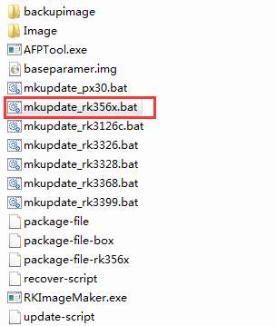
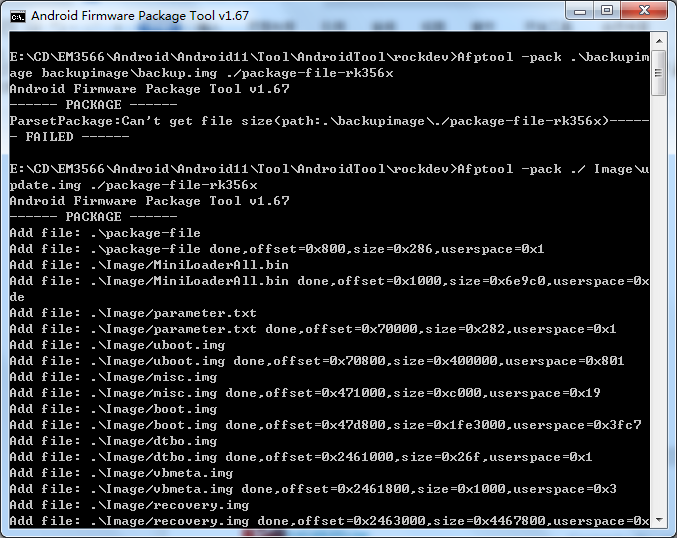
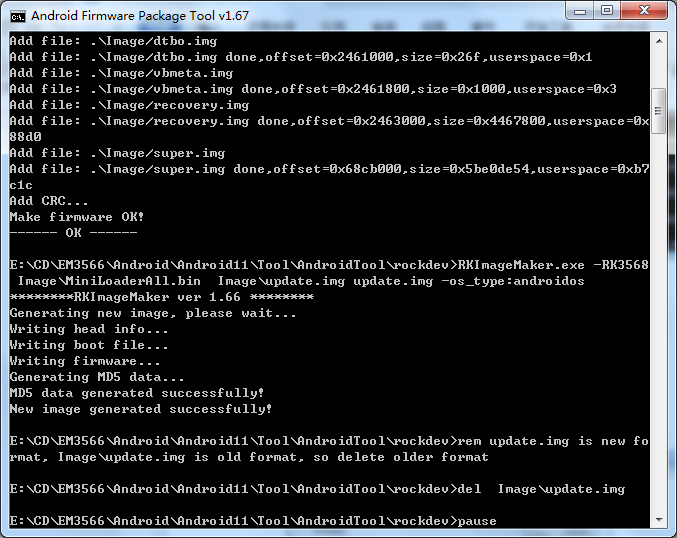
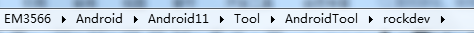
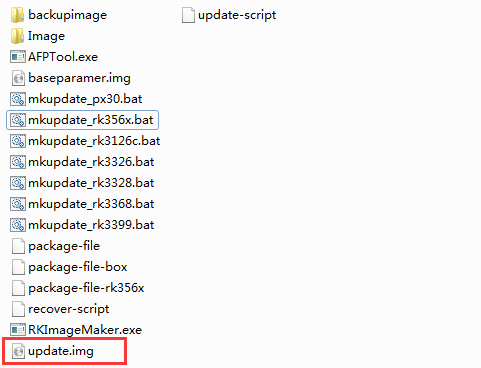

Software
========

Android
--------

1 Compiler Environment
^^^^^^^^^^^^^^^^^^^^^^^

1.1 Vmware10.0+ubuntu18.04
""""""""""""""""""""""""""

Install Vmware10.0 in windows OS, and then install ubuntu18.04 in VMware to compile. Please visit the
official website http://www.ubuntu.com/ to download and install ubuntu operating system.

.. note::

   buildroot should be complied by ubuntu 64bit OS.

1.2 Install OpenJDK1.8
""""""""""""""""""""""""""
.. code-block:: 

 sudo mkdir /usr/lib/java
 sudo tar zxvf java-8-openjdk-amd64.tar.gz –C /usr/lib/java/

Add the following information in the end of "/etc/profile"::

 export JAVA_HOME=/usr/lib/java/java-8-openjdk-amd64
 export JRE_HOME=/usr/lib/java/java-8-openjdk-amd64/jre
 export CLASSPATH=.:$JAVA_HOME/lib:$JRE_HOME/jre/lib:$CLASSPATH
 export PATH=$JAVA_HOME/bin:$JRE_HOME/jre/bin:$PATH

Execute command

.. code-block:: 

 source /etc/profile

Check if the jdk has been installed successfully and check the revised version:

.. code-block:: 

 java -version
 
1.2 Install Tools
""""""""""""""""""

* PC OS: ubuntu system
* Network: online  
* Permission: root

.. code-block:: 

 sudo apt-get install build-essential zlib1g-dev flex libx11-dev gperf libncurses5-dev bison lsb-core lib32z1-dev g++-multilib lib32ncurses5-dev uboot-mkimage g++-4.4-multilib repo git ssh make gcc libssl-dev liblz4-tool expect g++ patchelf chrpath gawk texinfo chrpath diffstat binfmt-support qemu-user-static live-build bison flex fakeroot cmake gcc-multilib g++-multilibdevice-tree-compiler python-pip ncurses-dev pyelftools unzip

2 Compile Source
^^^^^^^^^^^^^^^^^^^^^^^

Step 1, unzip the source and set the compile board

.. code-block:: 

 tar xvf android11.tar.gz
 cd android11
 ./build.sh -h   #view the build command

Step 2, compile uboo

.. code-block:: 

 cd u-boot
 ./make.sh rk3566

Step 3, compile the kernel
 
.. code-block:: 

 cd kernel
 make ARCH=arm64 rockchip_defconfig rk356x_evb.config android-11.config

for HDMI

.. code-block:: 

 make ARCH=arm64 em3566-boardcon-hdmi.img 

or LVDS
 
.. code-block:: 

 make ARCH=arm64 em3566-boardcon-lvds.img 
 
.. note::
 It will pop out **configuration the IO power Domain Map** window when first time compile kernel, you need to configure according to the table below.

.. figure:: ./image/IO-power-Domain-Map.png
   :align: center
   :alt: IO-power-Domain-Map
 
**boot.img** are generated in :file:`android11\kernel` directory.
 
.. Note:: 
 If only update kernel, compile kernel as follow
 
.. code-block:: 

 make ARCH=arm64 BOOT_IMG=../rockdev/Image-rk3566_r/boot.img em3566-boardcon-hdmi.img 
 # or
 make ARCH=arm64 BOOT_IMG=../rockdev/Image-rk3566_r/boot.img em3566-boardcon-lvds.img
 
Step 4, compile Android

.. code-block:: 

 source build/envsetup.sh
 lunch rk3566_r-userdebug
 make -j8

Step 5, Generated image file

.. code-block:: 

 ./mkimage.sh
 ./build.sh -u
 cd rockdev
 ls
 
Images and update.img are generated in current directory. 
After compilation, execute the follow command to clean the build.

.. code-block:: 

 ./build.sh cleanall

3 Images Operation
^^^^^^^^^^^^^^^^^^^^^^^

3.1 Pack Image
""""""""""""""""""

Step 1, copy all the files in Android directory :file:`rockdev/Image` to the windows :file:`AndroidTool/rockdev/Image`

Step 2, enter :file:`AndroidTool/rockdev/`, double-click to run **mkupdate_rk356x.bat**.

Step 3, the **update.img** will be generated in rockdev directory.

.. figure:: ./image/EM3566_SBC_Android11_recording.jpg
   :align: center
   :alt: Android directory path
  
.. figure:: ./image/EM3566_SBC_Android11_figure_(5).png
   :align: center
   :alt: Android directory path
   
.. figure:: ./image/EM3566_SBC_Android11_figure%(16).png
   :align: center
   :alt: copy files
   

   

   

  

 

   

 
3.2 Unzip Firmware
""""""""""""""""""

4 Install Tools
^^^^^^^^^^^^^^^^^^^^^^^

4.1 Install CP2102 Driver  
"""""""""""""""""""""""""""""

4.2 Install Rockchip Driver Assistant
""""""""""""""""""""""""""""""""""""""""

4.3 Install Serial Terminal Tool
"""""""""""""""""""""""""""""""""

5 Burn Images
^^^^^^^^^^^^^^^^^^^^^^^

6 Android Application
^^^^^^^^^^^^^^^^^^^^^^^

6.1 HDMI Display
""""""""""""""""""

6.2 SD Card
""""""""""""""""""

6.3 USB Host
""""""""""""""""""

6.4 Vedio Player
""""""""""""""""""

6.5 Ethernet
""""""""""""""""""

6.6 Record
""""""""""""""""""

6.7 RTC
""""""""""""""""""

6.8 WiFi
""""""""""""""""""

6.9 Bluetooth
""""""""""""""""""

6.10 Camera
""""""""""""""""""

6.11 RS485
""""""""""""""""""

6.12 RS232
""""""""""""""""""

6.13 M.2 SATA
""""""""""""""""""

6.14 IR
""""""""""""""""""

Debian
--------

Buildroot
--------

