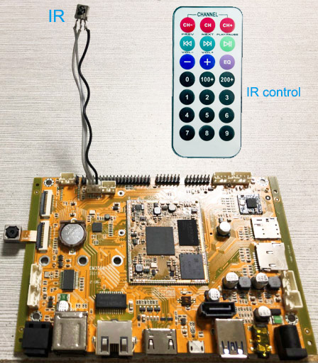
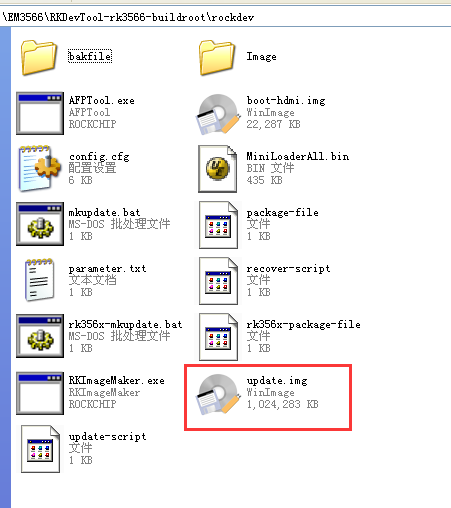
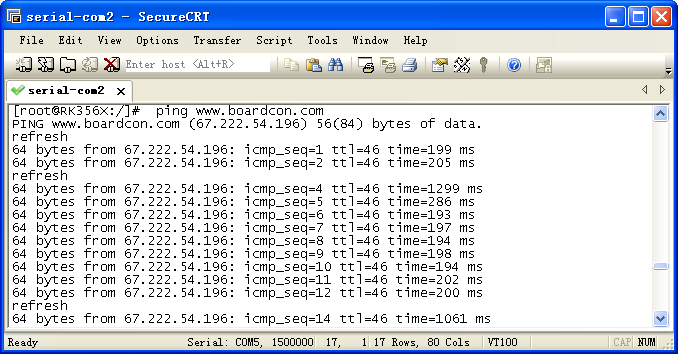

========
Software
========

Boardcon EM3566 supports Android, Debian and Buildroot OS. 

Install Debug Tools
===================

1 Install CP2102 Driver  
-----------------------

Plug the USB-to-UART cable CP2102 to the PC, unzip **CP2102WIN7.rar** on Windows, then click **preInstaller.exe** to install

.. figure:: ./image/EM3566_SBC_Android11_figure_18.png
   :alt: Install successful

.. figure:: ./image/EM3566_SBC_Android11_figure_19.png
   :alt: unzip files
      
Now the device will be listed under *Device Manager -> PORTS* with unique serial port assigned

.. figure:: ./image/EM3566_SBC_Android11_figure_19.png
   :alt: serial port path

2 Install Rockchip Driver Assistant
-------------------------------------

Path :file:`DriverAssitant_v5.1.1/DriverInstall.exe`

.. figure:: ./image/RK_Driver_Assitant_install-1.png
   :alt: RK_Driver_Assitant_install-1
   :width: 300px
   

After the installation is complete, connect the board and PC with Micro USB cable and press the **Recover** key and hold then power the board, in *Computer Management* can see the following information:

.. figure:: ./image/EM3566_SBC_Android11_figure_22.png
   :alt: serial port path

The WINDOW will pop up *found New Hardware Wizard* dialog box, choose to install from the specified location, and then select :file:`/DriverAssitant_v5.11/DriverAssitant_v5.1.1/ADBDriver`.

After the installation is complete in *Computer Management* can see the following information:

.. figure:: ./image/EM3566_SBC_Android11_figure_23.png
   :alt: installation complete

3 Install Serial Terminal Tool
-------------------------------

The serial terminal **SecureCRT** is used for debugging. It can be used directly after decompression. 
Open **SecureCRT.exe** after copy to PC path :file:`tools/windows/SecureCRT.exe`, then click the icon *Quick Connect* to config

.. figure:: ./image/EM3566_SBC_Android11_figure_24.png
   :alt: SecureCRT UI

Set the parameters as follow:

- Protocol: Serial
- Port: To be specified by user PC
- Baud rate: 1500000
- Please check **XON/XOFF** but not **RTS/CTS**
- Check *Save* session

.. figure:: ./image/EM3566_SBC_Android11_figure_26.png
   :alt: Set the parameters

After all, click *connect*

 
.. note:: 

 If open more than one serial terminal tools, and they use the same serial port, there will be reported the port is busy.
 **Solution**: Turn off the serial tool that unnecessary.

Android
=========

1 Compiler Environt
--------------------

1.1 Vmware10.0+ubuntu18.04
^^^^^^^^^^^^^^^^^^^^^^^^^^^

Install Vmware10.0 in windows OS, and then install ubuntu18.04 in VMware to compile. Please visit the
official website http://www.ubuntu.com/ to download and install ubuntu operating system.

.. note::

  Android should be complied by ubuntu 64bit OS.

1.2 Install OpenJDK1.8
^^^^^^^^^^^^^^^^^^^^^^^^

.. code-block:: 

 sudo mkdir /usr/lib/java
 sudo tar zxvf java-8-openjdk-amd64.tar.gz –C /usr/lib/java/

Add the following information in the end of :file:`/etc/profile`:

 export JAVA_HOME=/usr/lib/java/java-8-openjdk-amd64
 export JRE_HOME=/usr/lib/java/java-8-openjdk-amd64/jre
 export CLASSPATH=.:$JAVA_HOME/lib:$JRE_HOME/jre/lib:$CLASSPATH
 export PATH=$JAVA_HOME/bin:$JRE_HOME/jre/bin:$PATH

Execute command

.. code-block:: 

 source /etc/profile

Check if the jdk has been installed successfully and check the revised version:

.. code-block:: 

 java -version
 
1.3 Install Tools
^^^^^^^^^^^^^^^^^^

* PC OS: ubuntu system
* Network: online  
* Permission: root

.. code-block:: 

 sudo apt-get install build-essential zlib1g-dev flex libx11-dev gperf libncurses5-dev bison lsb-core lib32z1-dev g++-multilib lib32ncurses5-dev uboot-mkimage g++-4.4-multilib repo git ssh make gcc libssl-dev liblz4-tool expect g++ patchelf chrpath gawk texinfo chrpath diffstat binfmt-support qemu-user-static live-build bison flex fakeroot cmake gcc-multilib g++-multilibdevice-tree-compiler python-pip ncurses-dev pyelftools unzip

2 Compile Source
-----------------

Step 1, unzip the source and set the compile board

.. code-block:: 

 tar xvf android11.tar.gz
 cd android11
 ./build.sh -h   #view the build command

Step 2, compile uboo

.. code-block:: 

 cd u-boot
 ./make.sh rk3566

Step 3, compile the kernel
 
.. code-block:: 

 cd kernel
 make ARCH=arm64 rockchip_defconfig rk356x_evb.config android-11.config

for HDMI

.. code-block:: 

 make ARCH=arm64 em3566-boardcon-hdmi.img 

or LVDS
 
.. code-block:: 

 make ARCH=arm64 em3566-boardcon-lvds.img 
 
.. note::
 It will pop out **configuration the IO power Domain Map** window when first time compile kernel, you need to configure according to the table below.

.. figure:: ./image/IO-power-Domain-Map.png
   :align: center
   :alt: IO-power-Domain-Map
 
**boot.img** are generated in :file:`android11/kernel`.
 
.. Note:: 

 If only update kernel, compile kernel as follow
 
.. code-block:: 

 make ARCH=arm64 BOOT_IMG=../rockdev/Image-rk3566_r/boot.img em3566-boardcon-hdmi.img 
 # or
 make ARCH=arm64 BOOT_IMG=../rockdev/Image-rk3566_r/boot.img em3566-boardcon-lvds.img
 
Step 4, compile Android

.. code-block:: 

 source build/envsetup.sh
 lunch rk3566_r-userdebug
 make -j8

Step 5, Generated image file

.. code-block:: 

 ./mkimage.sh
 ./build.sh -u
 cd rockdev
 ls
 
Images and update.img are generated in current directory. 
After compilation, execute the follow command to clean the build.

.. code-block:: 

 ./build.sh cleanall

3 Images Operation
-------------------

3.1 Pack Image
^^^^^^^^^^^^^^^

Step 1, copy all the files in Android directory :file:`rockdev/Image` to the windows :file:`AndroidTool/rockdev/Image`

Step 2, enter :file:`AndroidTool/rockdev/`, double-click to run **mkupdate_rk356x.bat**.

Step 3, the **update.img** will be generated in rockdev directory.
  

   

   
.. figure:: ./image/EM3566_SBC_Android11_figure_7.png
   :align: left
   :alt: run mkupdate_rk356x.bat
   
.. figure:: ./image/EM3566_SBC_Android11_figure_8.png
   :align: center
   :alt: run mkupdate_rk356x.bat print out-1
   

  
.. figure:: ./image/EM3566_SBC_Android11_figure_10.png
   :alt: path
 
.. figure:: ./image/EM3566_SBC_Android11_figure_11.png
   :alt: generated update.img

3.2 Unzip Firmware
^^^^^^^^^^^^^^^^^^^^

Unzip Firmware in windows.

Step1, open **RKDevTool.exe** :file:`RKDevTool_Release/RKDevTool.exe`

.. figure:: ./image/EM3566_SBC_Android11_figure_12.png
   :alt: open RKDevTool.exe
   
Step 2, click *Advanced Function -> Firmware*, select **update.img**. Click *Unpack* to Unzip.

Step 3, Unpack finish as follow

.. figure:: ./image/EM3566_SBC_Android11_figure_14.png
   :alt: Unpack finish

The unzip files will be generated in :file:`/RKDevTool/RKDevTool_Release/Output/Android/Image`

.. figure:: ./image/EM3566_SBC_Android11_figure_15.png
   :alt: path

4 Burn Images
--------------

Step 1, unzip **RKDevTool-rk3566-buildroot** on Windows.

Step 2, open **RKDevTool.exe** Path: :file:`RKDevTool_Release/RKDevTool.exe`

.. figure:: ./image/EM3566_SBC_Android11_figure_28.png
   :alt: RKDevTool

Step 3, connect PC and development board with Micro USB cable, keep pressing the **Recover** Key and power the board until the windows PC shows *Found one LOADER Device*

.. figure:: ./image/EM3566_SBC_Android11_figure_29.jpg
   :alt: EM3566
   :align: center
   :width: 350px
   
.. figure:: ./image/EM3566_SBC_Android11_figure_30.png
   :alt: Found one LOADER Device
   
Step 4, click *Upgrade Firmware -> Firmware*, select **update.img**, Click *Upgrade* to flash

.. figure:: ./image/EM3566_SBC_Android11_figure_31.png
   :alt: select update.img
 
.. figure:: ./image/EM3566_SBC_Android11_figure_32.png
   :alt: Upgrade
 
User can also update the firmware separately.

Step 1, Click the column on the right side for the path of the file want to flash.

Step 2, Select the checkbox on the left.

Step 3, Click *Run* to flash the image.

.. figure:: ./image/EM3566_SBC_Android11_figure_34.png
   :alt: Upgrade separately-2

5 Android Application
----------------------

5.1 HDMI Display
^^^^^^^^^^^^^^^^^

Connect the board and monitor with a HDMI cable, then start up.

   
.. Note::
Note: The system default HDMI display. If use LVDS, please reflash **update_lvds.img**.

5.2 SD Card
^^^^^^^^^^^^

EM3566 supports SD Hot-plug.

.. figure:: ./image/EM3566_SBC_Android11_figure_36.png
   :alt: SD storage-1
   

5.3 USB Host
^^^^^^^^^^^^^

The USB Host can be used to connect USB mouse, USB keyboard, U-Disk or other USB devices. The EM3566 supports USB3.0(set the SW switch to **OFF OFF**).

5.4 Vedio Player
^^^^^^^^^^^^^^^^^

Copy video files to SD card or U_disk then insert it to the board. After system boot, open SD_card/U_disk and click video file to play.

   
.. figure:: ./image/EM3566_SBC_Android11_HDMI_OUT.jpg
   :alt: Vedio player

5.5 Ethernet
^^^^^^^^^^^^^

Connect the board and router with an Ethernet cable (default DHCP=Yes). Ping URL/IP at terminal, or open the browser to test Network.

.. code-block:: 

 ping www.boardcon.com

.. figure:: ./image/EM3566_SBC_Android11_figure_41.png
   :alt: Ethernet
.. figure:: ./image/EM3566_SBC_Android11_figure_42.png
   :alt: Ethernet-2
.. figure:: ./image/EM3566_SBC_Android11_Browse_site.jpg
   :alt: Browse_site

5.6 Record
^^^^^^^^^^^

Step 1, open the APP **Sound Recorder** in Android.

Step 2, click **Start** button to recording.

.. figure:: ./image/EM3566_SBC_Android11_figure_44.png
   :alt: recorder
.. figure:: ./image/EM3566_SBC_Android11_record.jpg
   :alt: start record
   :width: 350px
   
After finish recording, click **Stop** and select **Save** to store file.
Default storage path :file:`Internal Memory/Documents/Records`. If the headset is connected, default headset output, otherwise HDMI output.

5.7 RTC
^^^^^^^^

Execute the command **hwclock** at CRT terminal 

.. code-block:: 

  hwclock
  
Wait a moment then run *hwclock* again, it can be found the time has changed.

5.8 WiFi
^^^^^^^^^

Connect the WiFi antenna, then click *Settings -> Network&internet -> Wi-Fi -> turn on*, select the SSID from the list of available networks and enter the password.
After connected, user can ping URL/IP at terminal, or open the browser to test Network.

.. code-block:: 

  ping www.boardcon.com
  
.. figure:: ./image/EM3566_SBC_Android11_figure_48.png
   :alt: settings UI

5.9 Bluetooth
^^^^^^^^^^^^^^

Click *Settings -> Connected devices -> Pair new device*
Select the available device in the list to pair. After pairing, devices can connect with each other automatically

.. figure:: ./image/EM3566_SBC_Android11_figure_54.png
   :alt: Bluetooth Setting
.. figure:: ./image/EM3566_android_BT.jpg
   :alt: BT pair

5.10 Camera
^^^^^^^^^^^^

Connect the camera module (OV13850) to the development board camera0 before power on，then click the camera app to test.

.. figure:: ./image/EM3566_SBC_Android11_figure_53.png
   :alt: Camera icon

5.11 RS485
^^^^^^^^^^^

Connect the RS485 ports of Board A and B with the test cable. 

.. figure:: ./image/EM3566_SBC_Android11_figure_55.png
   :align: center
   :alt: Connect Board A and B

Open **cmd.exe** of PC (Path: :file:`Test/cmd.exe`). After power on, the PC will report that found new hardware if it never install the usb adb driver :file:`tools/adb`. At this time user need to click **InstallADB(x64).bat** or **InstallADB(x86).bat** to install. 
After install driver, copy the file **com** to :file:`windows C:/Users/Administrator`, then execute the commands at cmd.

.. code-block:: 

 adb root
 adb remount
 adb push com /system  
 adb shell
 chmod 777 /system/com    # Modify COM properties

For Board A, execute the follow commands at **Serial terminal A** to set RS485 as Receiver or send. 

.. code-block:: 

 ./system/com /dev/ttyS3 115200 8 0 1 
 
For Board B, execute the follow commands at **Serial terminal B** to set RS485 as Receiver or send. 

.. code-block:: 

  ./system/com /dev/ttyS3 115200 8 0 1 

5.12 RS232
^^^^^^^^^^^

Connect the RS232 RX and TX (UART4 Pin2&Pin3 or UART5 Pin2&Pin3) with the test cable. Execute the follow command to test.

.. code-block:: 

  ./system/com /dev/ttyS4 115200 8 0 1    # test UART4

.. code-block:: 

  ./system/com /dev/ttyS5 115200 8 0 1    # test UART5
 
.. figure:: ./image/EM3566_SBC_Android11_figure_58.png
   :alt: test UART5
 
5.13 M.2 SATA (SSD)
^^^^^^^^^^^^^^^^^^^^^

Format SSD to ext4 file system,then connect to board. Execute the follow command to mount SSD.

.. code-block:: 

   mkdir /data/ssd 
   mount -t ext4 /dev/block/nvme0n1 /data/ssd  
   ls /data/ssd
   
If the SSD has been automatically mounted, execute the follow command to test 

.. code-block:: 

     ls /run/media/nvme0n1 
    

   
.. figure:: ./image/EM3566_SBC_Android11_figure_1.png
   :alt: test SATA
  
5.14 IR
^^^^^^^^^^^

The EM3566 supports remote control. Connect IR receiver to the IR port. 

Debian
=========

1 Compiler Environment
-----------------------

1.1 Install ubuntu18.04
^^^^^^^^^^^^^^^^^^^^^^^^

Install Vmware10.0 in windows OS, and then install ubuntu18.04 in VMware to compile. Please visit the
official website http://www.ubuntu.com/ to download and install ubuntu operating system.

.. note::

  Debian should be complied by ubuntu 64bit OS.

1.2 Install Tools
^^^^^^^^^^^^^^^^^^

* PC OS: ubuntu system
* Network: online  
* Permission: root

.. code-block:: 

  sudo apt-get install build-essential
  sudo apt-get install zlib1g-dev
  sudo apt-get install flex
  sudo apt-get install libx11-dev
  sudo apt-get install gperf
  sudo apt-get install libncurses5-dev
  sudo apt-get install bison
  sudo apt-get install lsb-core
  sudo apt-get install lib32z1-dev
  sudo apt-get install g++-multilib
  sudo apt-get install lib32ncurses5-dev
  sudo apt-get install uboot-mkimage
  sudo apt-get install g++-4.4-multilib
  sudo apt-get install repo git ssh make gcc libssl-dev liblz4-tool
  sudo apt-get install expect g++ patchelf chrpath gawk texinfo chrpath diffstat binfmt-support
  sudo apt-get install qemu-user-static live-build bison flex fakeroot cmake gcc-multilib g++-multilib 
  sudo apt-get install device-tree-compiler python-pip ncurses-dev pyelftools unzip

2 Compile Source
-----------------
Step 1, unzip the source and set the compile board

.. code-block:: 

  tar xvf rk3566_linux_source.tar.bz2
  cd rk3566_linux_source\
  ./build.sh -h             # view the build command
  ./build.sh device/rockchip/rk356x/BoardConfig-rk3566-evb2-lp4x-v10.mk
 
Step 2, compile uboot

.. code-block:: 

   ./build.sh uboot 
   
Step 3, compile the kernel

.. code-block:: 

   ./build.sh kernel
   
.. note::
 It will pop out **configuration the IO power Domain Map** window when first time compile kernel, you need to configure according to the table below.

.. figure:: ./image/IO-power-Domain-Map.png
   :align: center
   :alt: IO-power-Domain-Map

**kernel.img, resource.img and boot.img** are generated in :file:`rk3566_linux_source/kernel`.

If want to configure the kernel, do it as below:

.. code-block:: 

   cd kernel
   make ARCH=arm64 menuconfig
   
Kernel use default config file is :file:`kernel/arch/arm64/config/rockchip_linux_defconfig` 

After reconfigure the kernel, please use the file :file:`kernel/.config` to replace :file:`rockchip_linux_defconfig` 

Step 4, compile recovery

.. code-block:: 

  ./build.sh recovery
  
Step 5, compile debian (Note: Compile debian need to use super user)

.. code-block:: 

  sudo tar xvf debian.tar.bz2
  sudo ./build.sh debian	
  
After compile, it will get  **linaro-rootfs.img** in the debian directory.
The directory :file:`debian/binary` is compile debian source get target file. If want to add files to debian system, please add to :file:`binary/` corresponding folder, and then use below command get **linaro-rootfs.img**:

.. code-block:: 

  sudo ./mk-image.sh
  mv linaro-rootfs.img rootfs.img
  
The file **rootfst.img** is finally that use to burn to board. 

Step 6, Generated other image file

.. code-block:: 

  ./mkfirmware.sh
  cd rockdev
  
Images are generated in current directory. 

After compilation, execute the follow command to clean the build.

.. code-block:: 

  ./build.sh cleanall

3 Images Operation
-------------------

3.1 Pack Image
^^^^^^^^^^^^^^^

Step 1, copy all the files in :file:`rk3566_linux_source/rockdev/Image` to the windows :file:`RKDevTool/rockdev/Image`

Step 2, enter :file:`RKDevTool/rockdev/`, double-click to run **mkupdate.bat**.

Step 3, the **update.img** will be generated in **rockdev** directory.

.. figure:: ./image/EM3566_Debian_3.jpg
   :alt: copy all files

   

     
3.2 Unzip Firmware
^^^^^^^^^^^^^^^^^^^

Unzip Firmware in windows.
Step 1, open **RKDevTool.exe** Path: :file:`RKDevTool_Release/RKDevTool.exe`

.. figure:: ./image/EM3566_Debian_34.png
   :alt: RKDevTool
   
Step 2, click *Advanced Function -> Firmware*, select **update.img**. Click *Unpack* to unzip.

.. figure:: ./image/EM3566_Debian_35.png
   :alt: Unpack

Unpack finish.

The unzip files will be generated in :file:`/RKDevTool/RKDevTool_Release/Output/Android/Image`.

4 Burn Images
--------------

Step 1, unzip **RKDevTool.rar** on Windows.

Step 2, open **RKDevTool.exe**  Path: :file:`RKDevTool_Release/RKDevTool.exe`

Step 3, connect PC and development board with Micro USB cable, keep pressing the **Recover** Key and power the board until the windows PC shows *Found one LOADER Device* release the **Recover** Key.

.. figure:: ./image/EM3566_SBC_Android11_figure_29.jpg
   :alt: connect PC and development board
   :align: center
   :width: 350px
   

   
Step 4, click *Upgrade Firmware -> Firmware*, select **update.img**. Click *Upgrade* to flash.

   

   
User can also update the firmware separately.

Step 1, Click the column on the right side for the path of the file want to flash.

Step 2, Select the checkbox on the left.

Step 3, Click "Run" to flash the image.

   

   

   

5 Debian Application
--------------------

5.1 HDMI Display
^^^^^^^^^^^^^^^^^
Connect the board and monitor with a HDMI cable, then start up.

.. Note::

 Note: The system default HDMI display. If use LVDS, please reflash update_lvds.img, or boot-mipi.img for MIPI LCD.

5.2 SD Card
^^^^^^^^^^^^^
EM3566 supports SD Hot-plug. 

   

5.3 USB Host
^^^^^^^^^^^^^
The USB Host can be used to connect USB mouse, USB keyboard, U-Disk or other USB devices.

5.4 Video Player
^^^^^^^^^^^^^^^^^

Copy video file (eg. test.mp4) to SD card or U_disk, then insert it to the board. After system boot open  SD card or U_disk，copy test.mp4 to :file:`usr/local` and execute follow command to play.

Test 1920x1080

.. code-block:: 

  ./usr/local/bin/test_dec-gst.sh
  # or
  gst-play-1.0 --flags=3 --videosink=xvimagesink /usr/local/test.mp4
  

   

 
Test 4K(max-fps to 50fps)

.. code-block:: 

  echo performance | tee $(find /sys/devices -name *governor)
  echo 400000000 > /sys/kernel/debug/clk/aclk_rkvdec/clk_rate
  export GST_DEBUG=fpsdisplaysink:10
  export KMSSINK_DISABLE_VSYNC=1
  export GST_MPP_VIDEODEC_DEFAULT_ARM_AFBC=1
  GST_DEBUG=fpsdisplaysink:5 gst-play-1.0 /media/linaro/TEST/test.mp4 --flags=3 --use-playbin3 --videosink="fpsdisplaysink  text-overlay=false video-sink=\"kmssink plane-id=87\" sync=false"

   
5.5 Ethernet
^^^^^^^^^^^^^

Connect the Board and router with an Ethernet cable (default DHCP=Yes). User can ping URL/IP at terminal, or open the browser to test Network.

.. code-block:: 

  ping www.boardcon.com
  

   

    

 
5.6 Record
^^^^^^^^^^^^

.. code-block:: 

   aplay -l               # View sound card devices
   arecord -Dhw:1,0 -d 10 -f cd -r 44100 -c 2 -t wav test.wav     # recording
   
for HDMI output 

.. code-block:: 

   aplay test.wav 
   
for earphone output
                
.. code-block:: 

    aplay -Dhw:1,0 test.wav 

5.7 RTC
^^^^^^^^^

Execute the command **hwclock** at CRT terminal 

.. code-block:: 

  hwclock
  
Wait a moment then run *hwclock* again, it can be found the time has changed.

.. figure:: ./image/EM3566_Debian_18.png
   :alt: RTC test

5.8 WiFi
^^^^^^^^^^

Connect the WiFi antenna, then click the network icon in the lower right corner of the UI interface, select the SSID from the list of available networks and enter the password.
After connected, user can ping URL/IP at terminal.

.. code-block:: 

  ping www.boardcon.com
  

5.9 Bluetooth
^^^^^^^^^^^^^^^^^^^^^^^^

Open Buletooth

.. code-block:: 

  bt_load_rtk_firmware

   
Click the Buletooth icon in the lower right corner of the UI, select the available device in the list to pair.  

 

5.10 SATA
^^^^^^^^^^^^

.. warning::

 Hot-plug is not supported for SATA. Please connect the SATA to the development board before power on.
 
The system is default USB3.0 mode. Please reflash boot-sata.img before test. 

Set the SW switch to SATA mode: ON ON 

Execute follow command to mount.

.. code-block:: 

  mount /dev/sda1 /mnt
  ls
  

5.11 RS485
^^^^^^^^^^^^
Connect the RS485 ports of Board A and B with the test cable. 

.. figure:: ./image/EM3566_SBC_Android11_figure_55.png
   :align: center
   :alt: Connect Board A and B

Copy the file **com** to the SD card, then insert the card into the board and powered on. After the system booting, execute the commands to copy the **com** from SD card to board.

.. code-block:: 

  cp /media/linaro/B412-0218/com /
  ls
  chmod 777 com    # Modify COM properties

For Board A, execute the follow commands at **Serial terminal A** to set RS485 as Receiver or Transmitter. 

.. code-block:: 

 ./com /dev/ttyS3 115200 8 0 1 
 
For Board B, execute the follow commands at **Serial terminal B** to set RS485 as Receiver or Transmitter. 

.. code-block:: 

  ./com /dev/ttyS3 115200 8 0 1 

5.12 UART
^^^^^^^^^^^

Connect the UARTs RX and TX with the test cable. Execute the follow command to test.

.. code-block:: 

  ./com /dev/ttyS4 115200 8 0 1      # Test UART4
  ./com /dev/ttyS5 115200 8 0 1      # Test UART5

 
5.13 M.2 SATA (SSD)
^^^^^^^^^^^^^^^^^^^

Format SSD to ext4 file system on ubuntu system before test: 

.. code-block::

  mke2fs -t ext4 /dev/block/nvme0n1 
  
Then connect the SSD to board. Execute the follow command to mount. 

.. code-block::

 mkdir /mnt/ssd 
 mount -t ext4 /dev/nvme0n1 /mnt/ssd 
 ls /mnt/ssd

5.14 4G (EC25/EC20 model)
^^^^^^^^^^^^^^^^^^^^^^^^

.. code-block::

 ifconfig eth0 down 
 cd  /etc/ppp/peers
 pppd call quectel-ppp & 
 ping www.boardcon.com

   
.. figure:: ./image/EM3566_Debian_28.png
   :alt: test 4G

   
5.15 IR
^^^^^^^^^^^^^^^^^^^^^^^^

Connect IR receiver to the connector then power on. Execute follow command to test.

.. code-block::
   cat /dev/input/event0
   

  
  
Buildroot
=========

1 Compiler Environment
-----------------------

1.1 Install ubuntu18.04
^^^^^^^^^^^^^^^^^^^^^^^^

Install Vmware10.0 in windows OS, and then install ubuntu18.04 in VMware to compile. Please visit the
official website http://www.ubuntu.com/ to download and install ubuntu operating system.

.. note::

  Buildroot should be complied by ubuntu 64bit OS.
  
1.2 Install OpenJDK1.8
^^^^^^^^^^^^^^^^^^^^^^^^

.. code-block::
  sudo mkdir /usr/lib/java
  sudo tar zxvf java-8-openjdk-amd64.tar.gz –C /usr/lib/java/
  
Add the following information in the end of :file:`/etc/profile`:

 export JAVA_HOME=/usr/lib/java/java-8-openjdk-amd64
 export JRE_HOME=/usr/lib/java/java-8-openjdk-amd64/jre
 export CLASSPATH=.:$JAVA_HOME/lib:$JRE_HOME/jre/lib:$CLASSPATH
 export PATH=$JAVA_HOME/bin:$JRE_HOME/jre/bin:$PATH

.. code-block::
  
  source /etc/profile
  
Check if the jdk has been installed successfully and view the revised version
  
.. code-block::
   
   java -version
  
1.3 Install Tools
^^^^^^^^^^^^^^^^^

* PC OS: ubuntu system
* Network: online  
* Permission: root

.. code-block::
  
  sudo apt-get install build-essential
  sudo apt-get install zlib1g-dev
  sudo apt-get install flex
  sudo apt-get install libx11-dev
  sudo apt-get install gperf
  sudo apt-get install libncurses5-dev
  sudo apt-get install bison
  sudo apt-get install lsb-core
  sudo apt-get install lib32z1-dev
  sudo apt-get install g++-multilib
  sudo apt-get install lib32ncurses5-dev
  sudo apt-get install uboot-mkimage
  sudo apt-get install g++-4.4-multilib
  sudo apt-get install repo git ssh make gcc libssl-dev liblz4-tool
  sudo apt-get install expect g++ patchelf chrpath gawk texinfo chrpath diffstat binfmt-support
  sudo apt-get install qemu-user-static live-build bison flex fakeroot cmake gcc-multilib g++-multilib 
  sudo apt-get install device-tree-compiler python-pip ncurses-dev pyelftools unzip

2 Compile Source
-----------------

Step 1, unzip the source and set the compile board

.. code-block::

  tar xvf rk3566_linux_source.tar.bz2
  cd rk3566_linux_source\
  ./build.sh -h             # view the build command
  ./build.sh device/rockchip/rk356x/BoardConfig-rk3566-evb2-lp4x-v10.mk
  
Step 2, compile uboot

.. code-block::

  ./build.sh uboot 
  
Step 3, compile the kernel

.. code-block::
   ./build.sh kernel

.. note::
 It will pop out **configuration the IO power Domain Map** window when first time compile kernel, you need to configure according to the table below.

.. figure:: ./image/IO-power-Domain-Map.png
   :align: center
   :alt: IO-power-Domain-Map
   
**kernel.img, resource.img and boot.img** are generated in :file:`rk3566_linux_source/kernel` 

Step 4, compile recovery

.. code-block::

   ./build.sh recovery

Step 5, compile buildroot

.. code-block::

   ./build.sh buildroot	
   # or
   ./build.sh rootfs

Step 6, Generated image file

.. code-block::

  ./mkfirmware.sh
  cd rockdev
  ls

Images are generated in current directory. 

After compilation, execute the follow command to clean the build.

.. code-block::

  ./build.sh cleanall

3 Images Operation
-------------------

3.1 Pack Image
^^^^^^^^^^^^^^

Step 1, copy all the files in Buildroot directory :file:`rockdev/Image` to the windows :file:`RKDevTool-rk3566-buildroot/rockdev/Image`

Step 2, enter :file:`RKDevTool-rk3566-buildroot/rockdev/`, double-click to run **mkupdate.bat**.

Step 3, the **update.img** will be generated in rockdev directory.

   

3.2 Unzip Firmware
^^^^^^^^^^^^^^^^^^^

Unzip Firmware in windows.

Step 1, open **RKDevTool.exe** Path: :file:`RKDevTool_Release/RKDevTool.exe`

.. figure:: ./image/EM3566_Buildroot_RKDevTool.png
   :alt: open RKDevTool
   
Step 2, click *Advanced Function -> Firmware*, select **update.img**. Click *Unpack* to Unzip.

.. figure:: ./image/EM3566_Buildroot_Unpack.png
   :alt: Unpack

Unpack finish.

.. figure:: ./image/EM3566_Buildroot_Unpack_2.png
   :alt: Unpack

The unzip files will be generated in :file:`/RKDevTool/RKDevTool_Release/Output/Android/Image`

4 Burn Images
-------------

Step 1, unzip **RKDevTool-rk3566-buildroot** on Windows.

Step 2, open **RKDevTool.exe** Path: :file:`RKDevTool_Release/RKDevTool.exe`

Step 3, connect PC and development board with Micro USB cable, keep pressing the **Recover** Key and power the board until the windows PC shows **Found one LOADER Device**.

.. figure:: ./image/EM3566_SBC_Android11_figure_29.jpg
   :alt: connect PC and development board
   :align: center
   :width: 350px
   

   
Step 4, click *Upgrade Firmware -> Firmware*, select **update.img**. Click *Upgrade* to flash.

 
User can also update the firmware separately.

Step 1, Click the column on the right side for the path of the file want to flash.

Step 2, Select the checkbox on the left.

Step 3, Click *Run* to flash the image.

 

 
5 Buildroot Application
-----------------------

5.1 HDMI Display
^^^^^^^^^^^^^^^^^^^

Connect the board and monitor with a HDMI cable, then start up.

   
.. Note::

 Note: The system default HDMI display. If use LVDS, please reflash update_lvds.img, or boot-mipi_10.1inch_lcd.img for MIPI LCD.
 
5.2 SD Card
^^^^^^^^^^^^^^^^^^^

EM3566 supports SD Hot-plug

   

 
5.3 USB Host
^^^^^^^^^^^^^

The USB Host can be used to connect USB mouse, USB keyboard, U-Disk or other USB devices.

 
5.4 Video player
^^^^^^^^^^^^^^^^^^

Copy video file to SD_card or U_disk and insert to the board to test.

   

5.5 Ethernet
^^^^^^^^^^^^^^

Connect the Board and router with an Ethernet cable (default DHCP=Yes). User can ping URL/IP at terminal.

.. code-block::
   ping www.boardcon.com

5.6 Record
^^^^^^^^^^^^

Execute follow command to start recording, speech in front of the microphone then can record.

.. code-block::

   aplay -l                       # View audio equipment

List of player device (LVDS display)

.. code-block::

   arecord -Dhw:0,0 -d 10 -f cd -r 44100 -c 2 -t wav test.wav  # recording and save as test.wav 
   
After finish recording, execute follow command to play record file by earphone. 

.. code-block::

  aplay test.wav
    

   
for HDMI display, execute follow command to test record:

.. code-block::

  arecord -Dhw:1,0 -d 10 -f cd -r 44100 -c 2 -t wav test.wav
  
After finish recording, execute follow command to play.

.. code-block::

  aplay test.wav            # HDMI output
  aplay -Dhw:1,0 test.wav   # headphone output

5.7 RTC
^^^^^^^^

Execute the command hwclock at CRT terminal 

.. code-block:: 

  hwclock
  
Wait a moment then run *hwclock* again, it can be found the time has changed.

5.8 WiFi
^^^^^^^^^^

Connect the WiFi antenna, then click* qsetting -> WiFi -> turn on*, select the SSID from the list of available networks and enter the password.

After connected, user can ping URL/IP at terminal.

.. code-block::

   ping www.boardcon.com

   

   

   
5.9 Bluetooth
^^^^^^^^^^^^^^

Click *qsetting -> WiFi -> turn on*

Select the available device in the list to pair.

   
5.10 SATA
^^^^^^^^^^^

.. warning::

 Hot-plug is not supported for SATA. Please connect the SATA to the development board before power on.
 
The system is default USB3.0 mode. Please reflash **boot-lvds-sata.img** before test. 

Set the SW switch to SATA mode: ON ON 

   
5.11 RS485
^^^^^^^^^^^^^

Connect the RS485 ports of Board A and B with the test cable. 

.. figure:: ./image/EM3566_SBC_Android11_figure_55.png
   :align: center
   :alt: Connect Board A and B

Copy the file **com** to the SD card, then insert the card into the board and powered on. After the system booting, execute the commands to copy the **com** from SD card to board.

.. code-block:: 

  cp /sdcard/com /
  ls
  chmod 777 com    # Modify COM properties
  

For Board A, execute the follow commands at **Serial terminal A** to set RS485 as Receiver or Transmitter. 

.. code-block:: 

 ./com /dev/ttyS3 115200 8 0 1 
 
For Board B, execute the follow commands at **Serial terminal B** to set RS485 as Receiver or Transmitter. 

.. code-block:: 

  ./com /dev/ttyS3 115200 8 0 1 

5.12 UART
^^^^^^^^^^^

Connect the UART ports RX and TX with the test cable. Execute the follow command to test

.. code-block::

  ./com /dev/ttyS4 115200 8 0 1        # Test UART4)
  ./com /dev/ttyS5 115200 8 0 1        # Test UART5)

   
5.13 M.2 SATA (SSD)
^^^^^^^^^^^^^^^^^^^

Format SSD to ext4 file system on ubuntu system before test

.. code-block::

  mke2fs -t ext4 /dev/block/nvme0n1 
  
Then connect the SSD to board. Execute the follow command to mount. 

.. code-block::

 mkdir /data/ssd 
 mount -t ext4 /dev/nvme0n1 /data/ssd
 ls /data/ssd
 
If the SSD has been automatically mounted, execute the follow command to test

.. code-block::

   ls /run/media/nvme0n1 
 

5.14 4G (EC25/EC20)
^^^^^^^^^^^^^^^^^^^

Execute the follow command to test 4G:

.. code-block::

  ifconfig eth0 down 
  cd  /etc/ppp/peers
  pppd call quectel-ppp & 
  ping www.boardcon.com

.. figure:: ./image/EM3566_Buildroot_test_4G_2.png
   :alt: test_4G

.. figure:: ./EM3566_Buildroot_Ping_IP.png
   :alt: test_4G

5.15 GPS
^^^^^^^^^

Execute the follow command to test GPS in the 4G model:

.. code-block::

   echo -e "AT+QGPS=1\r\n" > /dev/ttyUSB2
   cat /dev/ttyUSB1 

.. figure:: ./EM3566_Buildroot_Test_GPS.png
   :alt: Test GPS

.. figure:: ./EM3566_Buildroot_Test_GPS-2.png
   :alt: Test GPS

5.16 IR
^^^^^^^^

Connect IR receiver to the IR port. Execute command

.. code-block::

   cat /dev/input/event0
   
Press the button on the control, the board will receive the signals.

.. figure:: ./EM3566_Buildroot_IR.png
   :alt: Test IR

