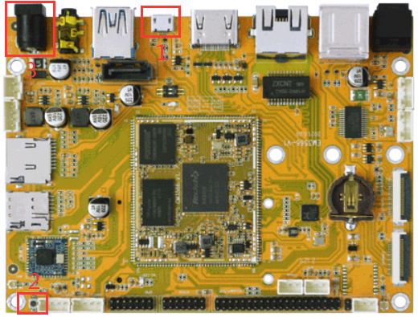

Software
========

Boardcon EM3566 supports Android, Debian and Buildroot OS. 

Install Debug Tools
--------------------

1 Install CP2102 Driver  
"""""""""""""""""""""""""""""

Plug the USB-to-UART cable CP2102 to the PC, unzip **CP2102WIN7.rar** on Windows, then click *preInstaller.exe* to install

.. figure:: ./image/EM3566_SBC_Android11_figure_17.png
   :alt: Install CP2102
   :width: 472px

.. figure:: ./image/EM3566_SBC_Android11_figure_19.png
   :alt: unzip files
      
Now the device will be listed under *Device Manager -> PORTS* with unique serial port assigned

.. figure:: ./image/EM3566_SBC_Android11_figure_19.png
   :alt: serial port path

2 Install Rockchip Driver Assistant
""""""""""""""""""""""""""""""""""""""""

Path :file:`DriverAssitant_v5.1.1/DriverInstall.exe`

   
.. figure:: ./image/RK_Driver_Assitant_install-2.png
   :alt: RK_Driver_Assitant_install-2
   :width: 300px

After the installation is complete, connect the board and PC with Micro USB cable and press the **Recover** key and hold then power the board, in *Computer Management* can see the following information:

.. figure:: ./image/EM3566_SBC_Android11_figure_22.png
   :alt: serial port path

The WINDOW will pop up found New Hardware Wizard dialog box, choose to install from the specified location, and then select :file:`/DriverAssitant_v5.11/DriverAssitant_v5.1.1/ADBDriver`.
After the installation is complete in *Computer Management* can see the following information:

.. figure:: ./image/EM3566_SBC_Android11_figure_23.png
   :alt: installation complete

3 Install Serial Terminal Tool
"""""""""""""""""""""""""""""""""

The serial terminal **SecureCRT** is used for debugging. It can be used directly after decompression. 
Open **SecureCRT.exe** after copy to PC path :file:`tools/windows/SecureCRT.exe`, then click the icon *Quick Connect* to config

.. figure:: ./image/EM3566_SBC_Android11_figure_24.png
   :alt: SecureCRT UI

.. figure:: ./image/EM3566_SBC_Android11_figure_25.png
   :alt: Quick Connect

Set the parameters as follow:

- Protocol: Serial
- Port: To be specified by user PC
- Baud rate: 1500000
- Please check **XON/XOFF** but not **RTS/CTS**
- Check *Save* session

After all, click *connect*

.. figure:: ./image/EM3566_SBC_Android11_figure_27.png
   :alt: Connect Serial
 
.. note:: 

 If open more than one serial terminal tools, and they use the same serial port, there will be reported the port is busy.
 **Solution**: Turn off the serial tool that unnecessary.

Android
--------

1 Compiler Environment
^^^^^^^^^^^^^^^^^^^^^^^

1.1 Vmware10.0+ubuntu18.04
""""""""""""""""""""""""""

Install Vmware10.0 in windows OS, and then install ubuntu18.04 in VMware to compile. Please visit the
official website http://www.ubuntu.com/ to download and install ubuntu operating system.

.. note::

   buildroot should be complied by ubuntu 64bit OS.

1.2 Install OpenJDK1.8
""""""""""""""""""""""""""
.. code-block:: 

 sudo mkdir /usr/lib/java
 sudo tar zxvf java-8-openjdk-amd64.tar.gz –C /usr/lib/java/

Add the following information in the end of "/etc/profile"::

 export JAVA_HOME=/usr/lib/java/java-8-openjdk-amd64
 export JRE_HOME=/usr/lib/java/java-8-openjdk-amd64/jre
 export CLASSPATH=.:$JAVA_HOME/lib:$JRE_HOME/jre/lib:$CLASSPATH
 export PATH=$JAVA_HOME/bin:$JRE_HOME/jre/bin:$PATH

Execute command

.. code-block:: 

 source /etc/profile

Check if the jdk has been installed successfully and check the revised version:

.. code-block:: 

 java -version
 
1.2 Install Tools
""""""""""""""""""

* PC OS: ubuntu system
* Network: online  
* Permission: root

.. code-block:: 

 sudo apt-get install build-essential zlib1g-dev flex libx11-dev gperf libncurses5-dev bison lsb-core lib32z1-dev g++-multilib lib32ncurses5-dev uboot-mkimage g++-4.4-multilib repo git ssh make gcc libssl-dev liblz4-tool expect g++ patchelf chrpath gawk texinfo chrpath diffstat binfmt-support qemu-user-static live-build bison flex fakeroot cmake gcc-multilib g++-multilibdevice-tree-compiler python-pip ncurses-dev pyelftools unzip

2 Compile Source
^^^^^^^^^^^^^^^^^^^^^^^

Step 1, unzip the source and set the compile board

.. code-block:: 

 tar xvf android11.tar.gz
 cd android11
 ./build.sh -h   #view the build command

Step 2, compile uboo

.. code-block:: 

 cd u-boot
 ./make.sh rk3566

Step 3, compile the kernel
 
.. code-block:: 

 cd kernel
 make ARCH=arm64 rockchip_defconfig rk356x_evb.config android-11.config

for HDMI

.. code-block:: 

 make ARCH=arm64 em3566-boardcon-hdmi.img 

or LVDS
 
.. code-block:: 

 make ARCH=arm64 em3566-boardcon-lvds.img 
 
.. note::
 It will pop out **configuration the IO power Domain Map** window when first time compile kernel, you need to configure according to the table below.

.. figure:: ./image/IO-power-Domain-Map.png
   :align: center
   :alt: IO-power-Domain-Map
 
**boot.img** are generated in :file:`android11\kernel` directory.
 
.. Note:: 

 If only update kernel, compile kernel as follow
 
.. code-block:: 

 make ARCH=arm64 BOOT_IMG=../rockdev/Image-rk3566_r/boot.img em3566-boardcon-hdmi.img 
 # or
 make ARCH=arm64 BOOT_IMG=../rockdev/Image-rk3566_r/boot.img em3566-boardcon-lvds.img
 
Step 4, compile Android

.. code-block:: 

 source build/envsetup.sh
 lunch rk3566_r-userdebug
 make -j8

Step 5, Generated image file

.. code-block:: 

 ./mkimage.sh
 ./build.sh -u
 cd rockdev
 ls
 
Images and update.img are generated in current directory. 
After compilation, execute the follow command to clean the build.

.. code-block:: 

 ./build.sh cleanall

3 Images Operation
^^^^^^^^^^^^^^^^^^^

3.1 Pack Image
""""""""""""""

Step 1, copy all the files in Android directory :file:`rockdev/Image` to the windows :file:`AndroidTool/rockdev/Image`

Step 2, enter :file:`AndroidTool/rockdev/`, double-click to run **mkupdate_rk356x.bat**.

Step 3, the **update.img** will be generated in rockdev directory.
  
.. figure:: ./image/EM3566_SBC_Android11_figure_5.png
   :align: left
   :alt: Android directory path
   
.. figure:: ./image/EM3566_SBC_Android11_figure_16.png
   :align: left
   :alt: copy files
   
.. figure:: ./image/EM3566_SBC_Android11_figure_7.png
   :align: left
   :alt: run mkupdate_rk356x.bat
   
.. figure:: ./image/EM3566_SBC_Android11_figure_8.png
   :align: center
   :alt: run mkupdate_rk356x.bat print out-1
   
.. figure:: ./image/EM3566_SBC_Android11_figure_9.png
   :align: center
   :alt: run mkupdate_rk356x.bat print out-2
  

 
.. figure:: ./image/EM3566_SBC_Android11_figure_11.png
   :alt: generated update.img

3.2 Unzip Firmware
"""""""""""""""""""""""

Unzip Firmware in windows.

Step1, open **RKDevTool.exe** :file:`RKDevTool_Release/RKDevTool.exe`

.. figure:: ./image/EM3566_SBC_Android11_figure_12.png
   :alt: open RKDevTool.exe
   
Step 2, click *Advanced Function -> Firmware*, select **update.img**. Click *Unpack* to Unzip.

.. figure:: ./image/EM3566_SBC_Android11_figure_13.png
   :alt: Unpack

Step 3, Unpack finish as follow

The unzip files will be generated in :file:`/RKDevTool/RKDevTool_Release/Output/Android/Image`

.. figure:: ./image/EM3566_SBC_Android11_figure_15.png
   :alt: path

.. figure:: ./image/EM3566_SBC_Android11_figure_16.png
   :alt: unzip files

4 Burn Images
^^^^^^^^^^^^^^^^^^^^^^^

Step 1, unzip *RKDevTool-rk3566-buildroot* on Windows.
Step 2, open *RKDevTool.exe* Path: :file:`RKDevTool_Release/RKDevTool.exe`

Step 3, connect PC and development board with Micro USB cable, keep pressing the **Recover** Key and power the board until the windows PC shows *Found one LOADER Device*

   

   
Step 4, click *Upgrade Firmware -> Firmware*, select **update.img**, Click *Upgrade* to flash

 

 
User can also update the firmware separately.

Step 1, Click the column on the right side for the path of the file want to flash.

Step 2, Select the checkbox on the left.

Step 3, Click *Run* to flash the image.

.. figure:: ./image/EM3566_SBC_Android11_figure_33.png
   :alt: Upgrade separately-1

5 Android Application
^^^^^^^^^^^^^^^^^^^^^^^

5.1 HDMI Display
""""""""""""""""""
Connect the board and monitor with a HDMI cable, then start up.

.. figure:: ./image/EM3566_SBC_Android11_figure_35.jpg
   :alt: HDMI display
   
.. Note::
Note: The system default HDMI display. If use LVDS, please reflash update_lvds.img.

5.2 SD Card
""""""""""""""""""

EM3566 supports SD Hot-plug.

   
.. figure:: ./image/EM3566_SBC_Android11_figure_37.png
   :alt: SD storage-2

5.3 USB Host
""""""""""""""""""
The USB Host can be used to connect USB mouse, USB keyboard, U-Disk or other USB devices. The EM3566 supports USB3.0 by set the SW switch to **OFF OFF**.

.. figure:: ./image/EM3566_SBC_Android11_figure_38.png
   :alt: USB storage

5.4 Vedio Player
""""""""""""""""""
Copy video files to sdcard/u_disk then insert it to the board. After system boot, open sdcard/udisk and click video file to play.

.. figure:: ./image/EM3566_SBC_Android11_figure_39.png
   :alt: Vedio player

5.5 Ethernet
""""""""""""""""""
Connect the board and router with an Ethernet cable (default DHCP=Yes). Ping URL/IP at terminal, or open the browser to test Network.

.. code-block:: 

 ping www.boardcon.com

.. figure:: ./image/EM3566_SBC_Android11_figure_42.png
   :alt: Ethernet-2

5.6 Record
""""""""""""""""""
Step 1, open the APP **Sound Recorder** in Android.
Step 2, click **Start** button to recording.

   
After finish recording, click **Stop** and select **Save** to store file.
Default storage path :file:`Internal Memory/Documents/Records`. If the headset is connected, default headset output, otherwise HDMI output.

.. figure:: ./image/EM3566_SBC_Android11_recording.jpg
   :alt: recording file

5.7 RTC
""""""""""""""""""
Execute the command hwclock at CRT terminal 

.. code-block:: 

  hwclock
  
Wait a moment then run *hwclock* again, it can be found the time has changed.

.. figure:: ./image/EM3566_SBC_Android11_figure_47.png
   :alt: RTC test

5.8 WiFi
""""""""""""""""""

Connect the WiFi antenna, then click *Settings -> Network&internet -> Wi-Fi -> turn on*, select the SSID from the list of available networks and enter the password.
After connected, user can ping URL/IP at terminal, or open the browser to test Network.

.. code-block:: 

  ping www.boardcon.com
  

.. figure:: ./image/EM3566_SBC_Android11_figure_49.png
   :alt: WIFI Setting
.. figure:: ./image/EM3566_SBC_Android11_figure_50.png
   :alt: connect wifi

5.9 Bluetooth
""""""""""""""""""

Click *Settings -> Connected devices -> Pair new device*
Select the available device in the list to pair. After pairing, devices can connect with each other automatically

.. figure:: ./image/EM3566_SBC_Android11_figure_52.jpg
   :alt: BT pair

5.10 Camera
""""""""""""""""""
Connect the camera module (OV13850) to the development board camera0 before power on，then click the camera app to test.

.. figure:: ./image/EM3566_SBC_Android11_camera.jpg
   :alt: Camera test

5.11 RS485
""""""""""""""""""

Connect the RS485 ports of Board A and B with the test line. 

Open **cmd.exe** of PC (Path: :file:`Test/cmd.exe`). After power on, the PC will report that found new hardware if it never install the usb adb driver :file:`tools/adb`. At this time user need to click **InstallADB(x64).bat** or **InstallADB(x86).bat** to install. 
After install driver, copy the file **com** to windows C:\Users\Administrator, then execute the commands at cmd.

.. code-block:: 

 adb root
 adb remount
 adb push com /system  
 adb shell
 chmod 777 /system/com    # Modify COM properties

.. figure:: ./image/EM3566_SBC_Android11_figure_56.png
   :alt: Eexecute commands at cmd

For Board A, execute the follow commands at **Serial terminal A** to set RS485 as Receiver or send. 

.. code-block:: 

 ./system/com /dev/ttyS3 115200 8 0 1 
 
For Board B, execute the follow commands at **Serial terminal B** to set RS485 as Receiver or send. 

.. code-block:: 

  ./system/com /dev/ttyS3 115200 8 0 1 

5.12 RS232
""""""""""""""""""

Connect the RS232 RX and TX (UART1 Pin2&Pin3 or UART2 Pin2&Pin3) with the test line. Execute the follow command to test.

For UART1

.. code-block:: 

  ./system/com /dev/ttyS4 115200 8 0 1 

.. figure:: ./image/EM3566_SBC_Android11_figure_57.png
   :alt: test UART1
 

For UART2

.. code-block:: 

  ./system/com /dev/ttyS5 115200 8 0 1 
 

 
5.13 M.2 SATA
""""""""""""""""""
Format SSD to ext4 file system,then connect to board. Execute the follow command to mount ssd

.. code-block:: 

   mkdir /data/ssd 
   mount -t ext4 /dev/block/nvme0n1 /data/ssd  
   ls /data/ssd
   
If the ssd has been automatically mounted, execute the follow command to test 

.. code-block:: 

     ls /run/media/nvme0n1 
    
.. figure:: ./image/EM3566_SBC_Android11_figure_59.png
   :alt: test SATA
   

  
5.14 IR
""""""""""""""""""

Connect IR receiver to the IR port. The EM3566 supports remote control.

.. figure:: ./image/EM3566_SBC_Android11_IR.jpg
   :align: left
   :alt: test IR
   :width: 400px

Debian
--------

Buildroot
--------

